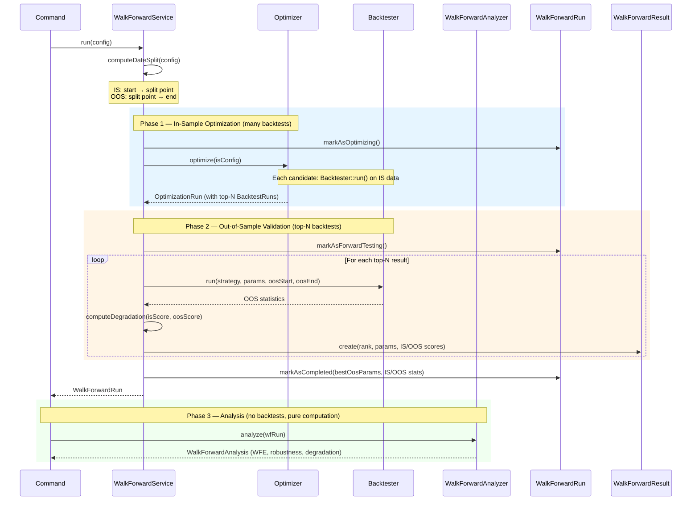

# AlphaForge - Laravel Trading Backtesting System

A comprehensive trading backtesting system ported from Symfony to Laravel 12. This system provides high-performance backtesting capabilities for algorithmic trading strategies with support for multi-timeframe analysis, comprehensive statistics, real-time progress broadcasting, and market data acquisition from 100+ cryptocurrency exchanges.

## Overview

AlphaForge is a Laravel port of the stochastix trading backtesting system. It maintains all the core functionality of the original Symfony application while leveraging Laravel's ecosystem for queue management, broadcasting, and database operations while adding significant new capabilities.

## Features

- **High-Performance Backtesting**: Uses the `ds` extension's `Ds\Vector` and `Ds\Map` for memory-efficient time series data
- **BCMath Precision**: All financial calculations use arbitrary precision arithmetic
- **Dual-Timeframe Execution**: Generate signals on a higher timeframe (e.g., H1) while processing orders and SL/TP at a lower timeframe (e.g., M1) for improved accuracy
- **Multi-Timeframe Support**: Strategies can access multiple timeframes simultaneously
- **Comprehensive Statistics**: 30+ metrics including Sharpe Ratio, Sortino Ratio, CAGR, Max Drawdown, etc.
- **Real-time Progress**: WebSocket broadcasting of backtest progress via Laravel Reverb
- **Queue-Based Execution**: Background job processing with dedicated queues
- **Strategy Auto-Discovery**: Automatic discovery of strategies via PHP 8 attributes
- **Market Data Acquisition**: Download OHLCV data from 100+ exchanges via CCXT library
- **Gap Detection**: Automatically detects and fills gaps in historical data
- **Binary Storage**: Efficient binary format (.stchx) for market data storage
- **Data Conversion**: Convert OHLCV data to Heiken-Ashi, fixed-brick Renko, and ATR-based Renko formats
- **Parameter Optimization**: Multi-method parameter optimization (grid search, random search, genetic algorithm) with composite objective functions
- **Parallel Execution**: Fork-based parallelism (`--runner=fork --workers=8`) with automatic CPU core detection and copy-on-write memory sharing for near-linear speedup
- **Market Data Preloading**: OHLCV data loaded once and shared across all backtest evaluations in an optimization run
- **Walk-Forward Analysis**: Unified backtest + forward-test command that optimizes on in-sample data and validates on out-of-sample data to detect overfitting
- **Robustness Classification**: Automatic classification (robust / marginal / likely_overfit) with human-readable interpretation
- **Spearman Rank Correlation**: IS-OOS rank stability metric to assess whether optimization ranking predicts OOS performance
- **Walk-Forward Export**: Export analysis results to CSV or JSON for external analysis

## Directory Structure

```
app/AlphaForge/
|-- Backtesting/
|   |-- Model/
|   |   |-- BacktestCursor.php      # Tracks current bar index during backtest
|   |   |-- BacktestRun.php         # Eloquent model for backtest records
|   |   |-- OptimizationRun.php      # Eloquent model for optimization runs
|   |   |-- WalkForwardRun.php       # Eloquent model for walk-forward runs
|   |   `-- WalkForwardResult.php    # Eloquent model for walk-forward results (IS/OOS pairs)
|   |-- Service/
|   |   |-- Backtester.php          # Main backtesting engine (single & dual-timeframe)
|   |   `-- ParameterOptimizerService.php  # Legacy parameter optimization (backward compat)
|   |-- Optimization/
|   |   |-- Optimizer.php           # Main optimization orchestrator
|   |   |-- OptimizationConfig.php  # Optimization configuration DTO
|   |   |-- OptimizationMethod.php  # Enum: grid, random, genetic
|   |   |-- OptimizationProgress.php # Progress event value object
|   |   |-- MarketDataLoader.php    # Preloads OHLCV data once before optimization
|   |   |-- MarketDataSnapshot.php  # Immutable DTO holding preloaded raw OHLCV arrays
|   |   |-- ParallelRunnerMode.php  # Enum: sync, fork, queue
|   |   |-- ForkParallelRunner.php  # pcntl_fork-based parallel backtest executor
|   |   |-- ParameterSpace.php      # Parameter space built from #[Input] attributes
|   |   |-- ParameterDimension.php  # Single parameter axis with values/clamp/random
|   |   |-- ScoredResult.php        # Scored parameter set value object
|   |   |-- TopNResults.php         # Keeps top-N ranked results efficiently
|   |   |-- Generator/
|   |   |   |-- ParameterGeneratorInterface.php  # Generator contract with inform() feedback
|   |   |   |-- GridGenerator.php          # Cartesian product generator
|   |   |   |-- RandomGenerator.php        # Random sampling generator
|   |   |   `-- GeneticGenerator.php       # Genetic algorithm with tournament selection
|   |   |-- Objective/
|   |   |   |-- ObjectiveFunctionInterface.php  # Scoring contract
|   |   |   |-- SingleMetricObjective.php  # Single metric (backward compat)
|   |   |   |-- CompositeObjective.php     # Weighted multi-metric scoring
|   |   |   |-- ObjectiveWeight.php        # Metric + coefficient pair
|   |   |   |-- ObjectivePresets.php       # Preset objectives (balanced, conservative, etc.)
|   |   |   `-- ObjectiveFactory.php       # Creates objective from string or interface
|   |   `-- Runner/
|   |       |-- OptimizationRunnerInterface.php  # Runner contract
|   |       `-- LightweightOptimizationRunner.php # Runs Backtester without per-run Eloquent
|   `-- WalkForward/
|       |-- WalkForwardService.php   # Orchestrator: optimize IS → validate OOS
|       |-- WalkForwardAnalyzer.php  # Computes WFE, degradation, robustness, classification, Spearman correlation
|       |-- WalkForwardAnalysis.php  # Readonly analysis result DTO
|       `-- WalkForwardExporter.php  # CSV/JSON export formatting
|   |-- Dto/
|   |   |-- BacktestConfiguration.php  # Backtest config DTO (includes execution_timeframe)
|   |   |-- OptimizationResult.php  # Optimization result DTO
|   |   `-- WalkForwardConfiguration.php  # Walk-forward config DTO
|-- Common/
|   |-- Enum/
|   |   |-- AppliedPriceEnum.php    # Price types for indicator calculation
|   |   |-- DirectionEnum.php       # Long/Short direction
|   |   |-- OhlcvEnum.php           # OHLCV field identifiers
|   |   |-- TALibFunctionEnum.php    # TA-Lib function mappings
|   |   `-- TimeframeEnum.php       # Trading timeframes (1m to 1M)
|   |-- Model/
|   |   |-- MutableSeries.php       # Mutable time series
|   |   |-- MultiTimeframeOhlcvSeries.php  # Multi-timeframe container
|   |   |-- OhlcvSeries.php         # OHLCV data container
|   |   `-- Series.php              # Immutable time series (cursor-relative indexing)
|   `-- Util/
|       `-- Math.php                 # BCMath statistical functions
|-- Condition/
|   |-- ConditionInterface.php      # Composable boolean condition contract
|   |-- AbstractCondition.php       # Default and/or/not composition
|   |-- CrossCondition.php          # Crosses-above / crosses-below detection
|   |-- ComparisonCondition.php     # >, <, >=, <= comparisons
|   |-- TrendCondition.php          # Rising / falling over N bars
|   |-- LogicalCondition.php        # AND / OR composition
|   `-- NotCondition.php            # Negation
|-- Conversion/
|   |-- RenkoConverter.php          # Fixed-brick Renko conversion
|   `-- AtrRenkoConverter.php       # ATR-based Renko conversion
|-- Data/
|   |-- Dto/
|   |   `-- DownloadRequestDto.php   # Download request data transfer
|   |-- Exception/
|   |   |-- DataFileNotFoundException.php
|   |   |-- DownloadCancelledException.php
|   |   |-- DownloaderException.php
|   |   |-- EmptyHistoryException.php
|   |   `-- ExchangeException.php
|   |-- Model/
|   |   `-- MarketDataDownload.php  # Eloquent model for downloads
|   `-- Service/
|       |-- BinaryStorage.php       # Binary .stchx file I/O
|       |-- BinaryStorageInterface.php
|       |-- DataAvailabilityService.php  # Manifest of available data
|       |-- DataInspectionService.php    # Data file inspection
|       |-- MarketDataService.php        # Exchange/symbol listing
|       |-- OhlcvDownloader.php          # Main download orchestration
|       `-- Exchange/
|           |-- CcxtAdapter.php          # CCXT exchange adapter
|           |-- ExchangeAdapterInterface.php
|           `-- ExchangeFactory.php        # CCXT instance factory
|-- Events/
|   |-- BacktestProgress.php        # Backtest broadcasting event
|   `-- DownloadProgress.php        # Download broadcasting event
|-- Http/
|   |-- Controllers/
|   |   `-- Api/
|   |       |-- BacktestController.php
|   |       `-- StrategyController.php
|   |   `-- AlphaForge/Data/
|   |       |-- DataAvailabilityController.php
|   |       |-- DownloadController.php
|   |       |-- ExchangesController.php
|   |       |-- InspectController.php
|   |       `-- SymbolsController.php
|-- Jobs/
|   |-- RunBacktestJob.php          # Queue job for backtests
|   `-- DownloadMarketDataJob.php   # Queue job for downloads
|-- Order/
|   |-- Dto/
|   |   |-- ExecutionResult.php      # Order execution result
|   |   |-- OrderSignal.php         # Trading signal from strategy
|   |   |-- PendingOrder.php         # Order awaiting execution
|   |   `-- PositionDto.php          # Position data (includes exitTag) (includes exitTag)
|   |-- Enum/
|   |   `-- OrderTypeEnum.php       # Market/Limit/Stop/StopLimit
|   `-- Model/
|       |-- OrderManager.php        # Order queue management
|       `-- PortfolioManager.php      # Position and cash management
|-- ExitRule/
|   |-- ExitRuleInterface.php       # Exit rule contract
|   |-- PriceBasedExitRule.php      # Marker interface for price-based rules
|   |-- ExitContext.php             # Value object: position + bar data + water marks
|   |-- ExitTrigger.php             # Value object: rule ID + exit price + tag
|   |-- ExitRuleSet.php             # Composable rule container with priority evaluation
|   |-- StaticStopLoss.php          # Fixed price stop-loss (wraps legacy logic)
|   |-- StaticTakeProfit.php        # Fixed price take-profit (wraps legacy logic)
|   |-- TrailingStop.php            # Trailing stop (% or ATR-based distance)
|   |-- ConditionExit.php           # Exits when a ConditionInterface evaluates true
|   |-- MaxBarsInPosition.php       # Time-based exit after N bars
|   `-- DefaultExitRules.php        # Trait returning null from getExitRules()
|-- Plot/
|   `-- PlotDefinition.php           # Chart plot definitions
|-- Indicator/
|   `-- Model/
|       |-- IndicatorContext.php         # Strategy indicator computation + caching layer
|       |-- IndicatorRegistry.php        # Data-driven TaLibHybrid function registry (100+ indicators)
|       |-- IndicatorResult.php          # Multi-output indicator container
|       |-- IndicatorResultInterface.php # Multi-output contract
|       |-- IndicatorInterface.php       # Plot-system indicator (unchanged)
|       `-- IndicatorManager.php         # Plot-system manager (unchanged)
|-- TimeSeries/
|   |-- TimeSeriesInterface.php     # Behavioral time series contract
|   `-- ArrayTimeSeries.php         # Absolute-indexed float[] with condition methods
|-- Condition/
|   |-- ConditionInterface.php      # Composable boolean condition contract
|   |-- AbstractCondition.php       # Default and/or/not composition
|   |-- CrossCondition.php          # Crosses-above / crosses-below detection
|   |-- ComparisonCondition.php     # >, <, >=, <= comparisons
|   |-- TrendCondition.php          # Rising / falling over N bars
|   |-- LogicalCondition.php        # AND / OR composition
|   `-- NotCondition.php            # Negation
|-- Strategy/
|   |-- Attribute/
|   |   |-- AsStrategy.php          # Strategy metadata attribute
|   |   `-- Input.php               # Strategy input definition with optimization ranges
|   |-- Dto/
|   |   |-- InputDefinitionDto.php
|   |   `-- StrategyDefinitionDto.php
|   |-- Model/
|   |   `-- StrategyContextInterface.php
|   |-- Service/
|   |   |-- StrategyRegistry.php     # Auto-discovery and registration
|   |   `-- StrategyRegistryInterface.php
|   `-- StrategyInterface.php        # Strategy contract
```

## Artisan Commands

AlphaForge provides comprehensive CLI commands for all operations. All commands are under the `alphaforge:` namespace.

### Data Management

#### `alphaforge:data:import` - Import Market Data

Download and store OHLCV market data from an exchange.

```bash
php artisan alphaforge:data:import <exchange> <market> <timeframe> <startdate> [enddate] [options]
```

**Arguments:**

| Argument | Description | Required |
|---------|-------------|----------|
| `exchange` | Exchange identifier (e.g., `binance`, `kraken`) | Yes |
| `market` | Trading pair symbol (e.g., `BTC/USDT`) | Yes |
| `timeframe` | Timeframe (e.g., `1m`, `5m`, `1h`, `1d`) | Yes |
| `startdate` | Start date (Y-m-d or Y-m-d H:i:s) | Yes |
| `enddate` | End date (Y-m-d or Y-m-d H:i:s, defaults to now) | No |

**Options:**

| Option | Description |
|--------|-------------|
| `--force` | Force overwrite existing data |

**Example:**

```bash
# Download market data
php artisan alphaforge:data:import binance BTC/USDT 1h 2023-01-01 2024-01-01
```

---

#### `alphaforge:data:update` - Update Market Data

Update existing market data to the latest available data.

```bash
php artisan alphaforge:data:update <exchange> <market> <timeframe> [enddate] [options]
```

**Arguments:**

| Argument | Description | Required |
|---------|-------------|----------|
| `exchange` | Exchange identifier | Yes |
| `market` | Trading pair symbol | Yes |
| `timeframe` | Timeframe | Yes |
| `enddate` | End date (Y-m-d or Y-m-d H:i:s, defaults to now) | No |

**Options:**

| Option | Description |
|--------|-------------|
| `--with-dependencies` | Also update all derived data files (Renko, Heiken-Ashi, etc.) |

**Examples:**

```bash
# Update existing data to latest
php artisan alphaforge:data:update binance BTC/USDT 1h

# Update existing data up to a specific date
php artisan alphaforge:data:update binance BTC/USDT 1h 2024-06-01

# Update OHLCV data and cascade the update to all derived files
php artisan alphaforge:data:update binance BTC/USDT 1h --with-dependencies
```

---

#### `alphaforge:data:delete` - Delete Market Data

Delete stored market data files.

```bash
php artisan alphaforge:data:delete <exchange> <market> <timeframe> [options]
```

**Arguments:**

| Argument | Description | Required |
|---------|-------------|----------|
| `exchange` | Exchange identifier | Yes |
| `market` | Trading pair symbol | Yes |
| `timeframe` | Timeframe | Yes |

**Options:**

| Option | Description |
|--------|-------------|
| `--force` | Skip confirmation prompt |

**Example:**

```bash
php artisan alphaforge:data:delete binance BTC/USDT 1h --force
```

---

#### `alphaforge:data:info` - Inspect Market Data

Display metadata and statistics for stored market data.

```bash
php artisan alphaforge:data:info <exchange> <market> <timeframe>
```

**Arguments:**

| Argument | Description | Required |
|---------|-------------|----------|
| `exchange` | Exchange identifier | Yes |
| `market` | Trading pair symbol | Yes |
| `timeframe` | Timeframe | Yes |

**Example:**

```bash
php artisan alphaforge:data:info binance BTC/USDT 1h
```

---

#### `alphaforge:data:list` - List Stored Data

List all stored market data files with optional filtering.

```bash
php artisan alphaforge:data:list [options]
```

**Options:**

| Option | Description |
|--------|-------------|
| `--exchange-filter=` | Filter by exchange |
| `--symbol-filter=` | Filter by symbol |

**Examples:**

```bash
# List all stored data
php artisan alphaforge:data:list

# List data for specific exchange
php artisan alphaforge:data:list --exchange-filter=binance
```

---

#### `alphaforge:data:export` - Export Market Data

Export stored market data (not yet implemented).

```bash
php artisan alphaforge:data:export
```

---

#### `alphaforge:data:repair` - Repair Corrupted Data Files

Scans and repairs corrupted market data files by fixing header record counts.

```bash
php artisan alphaforge:data:repair [options]
```

**Options:**

| Option | Description |
|--------|-------------|
| `--dry-run` | Show what would be fixed without making changes |
| `--exchange-filter=` | Filter by exchange (e.g., `binance`) |
| `--symbol-filter=` | Filter by symbol (e.g., `BTCUSDT`) |

**Examples:**

```bash
# Scan all files and preview changes
php artisan alphaforge:data:repair --dry-run

# Repair specific symbol
php artisan alphaforge:data:repair --symbol-filter=BTCUSDT

# Repair specific exchange
php artisan alphaforge:data:repair --exchange-filter=binance
```

#### `alphaforge:data:aggregate` - Timeframe Aggregation

Aggregate OHLCV data from a lower timeframe to a higher timeframe (e.g., 1m → 1h).

```bash
php artisan alphaforge:data:aggregate <exchange> <market> <source_timeframe> <target_timeframe> [options]
```

**Arguments:**

| Argument | Description | Example |
|---------|-------------|---------|
| `exchange` | Exchange identifier | `binance` |
| `market` | Trading pair symbol | `BTC/USDT` |
| `source_timeframe` | Source timeframe to aggregate from | `1m`, `5m`, `15m` |
| `target_timeframe` | Target timeframe to aggregate to | `1h`, `4h`, `1d` |

**Options:**

| Option | Description |
|--------|-------------|
| `--force` | Overwrite target file if it exists |
| `--update` | Incrementally update the target file by appending new aggregated data |

**Examples:**

```bash
# Aggregate 1-minute data to 1-hour
php artisan alphaforge:data:aggregate binance BTC/USDT 1m 1h

# Aggregate 5-minute data to 4-hour
php artisan alphaforge:data:aggregate binance ETH/USDT 5m 4h --force

# Incrementally update an existing aggregated file with new source data
php artisan alphaforge:data:aggregate binance BTC/USDT 1m 1h --update
```

---

### Backtesting Commands

#### `alphaforge:backtest:run` - Run a Backtest

Run a strategy backtest from the command line.

```bash
php artisan alphaforge:backtest:run <strategy> <symbols*> [options]
```

**Arguments:**

| Argument | Description | Example |
|---------|-------------|---------|
| `strategy` | Strategy alias | `sma_crossover`, `rsi_strategy` |
| `symbols*` | Trading symbols to backtest (multiple allowed) | `BTCUSDT ETHUSDT` |

**Options:**

| Option | Description | Default |
|--------|-------------|---------|
| `--exchange=` | Exchange identifier | `binance` |
| `--timeframe=` | Signal timeframe | `1h` |
| `--execution-timeframe=` | Lower timeframe for order/position execution (e.g., `1m`, `5m`) | - |
| `--data-type=` | Market data type to backtest against: `ohlcv`, `heikenashi`, `renko`, `atr_renko` | `ohlcv` |
| `--brick-size=` | Brick size for `renko` data type (e.g., `0.001`, `10`, `100`) | - |
| `--atr-period=` | ATR period for `atr_renko` data type (e.g., `14`) | - |
| `--capital=` | Initial capital in quote currency | `10000` |
| `--stake-currency=` | Stake currency | `USDT` |
| `--start-date=` | Start date (Y-m-d or Y-m-d H:i:s) | - |
| `--end-date=` | End date (Y-m-d or Y-m-d H:i:s) | - |
| `--inputs=` | Strategy inputs as JSON string | `'{"fastPeriod":10}'` |
| `--async` | Queue the backtest instead of running synchronously | - |
| `--force` | Overwrite and re-run if a completed backtest with the same parameters already exists | - |

**Examples:**

```bash
# Basic backtest with default parameters
php artisan alphaforge:backtest:run sma_crossover BTCUSDT

# Backtest with custom parameters
php artisan alphaforge:backtest:run sma_crossover BTCUSDT --timeframe=4h --capital=50000

# Backtest with strategy inputs
php artisan alphaforge:backtest:run sma_crossover BTCUSDT --inputs='{"fastPeriod":5,"slowPeriod":20}'

# Backtest with date range
php artisan alphaforge:backtest:run sma_crossover BTCUSDT --start-date="2023-01-01" --end-date="2024-01-01"

# Queue backtest for async execution
php artisan alphaforge:backtest:run sma_crossover BTCUSDT --async

# Backtest multiple symbols at once
php artisan alphaforge:backtest:run sma_crossover BTCUSDT ETHUSDT SOLUSDT --timeframe=1h
# Force re-run: overwrite existing completed backtest with same parameters
php artisan alphaforge:backtest:run sma_crossover BTCUSDT --timeframe=1h --force

# Force multiple symbols re-run
php artisan alphaforge:backtest:run sma_crossover BTCUSDT ETHUSDT SOLUSDT --timeframe=1h --force
```

##### Backtesting Against Renko and Heiken-Ashi Data

By default, backtests run against raw OHLCV data (`--data-type=ohlcv`). You can also backtest against derived data formats:

| Data Type | Description | Required Option |
|-----------|-------------|-----------------|
| `ohlcv` | Raw OHLCV candles (default) | None |
| `heikenashi` | Heiken-Ashi smoothed candles | None |
| `renko` | Fixed-brick Renko bricks | `--brick-size=<size>` |
| `atr_renko` | ATR-based dynamic Renko bricks | `--atr-period=<period>` |

**Examples:**

```bash
# Backtest against Heiken-Ashi data
php artisan alphaforge:backtest:run sma_crossover BTCUSDT --data-type=heikenashi

# Backtest against fixed-brick Renko (brick size = 100)
php artisan alphaforge:backtest:run sma_crossover BTCUSDT --data-type=renko --brick-size=100

# Backtest against ATR-based Renko (ATR period = 14)
php artisan alphaforge:backtest:run sma_crossover BTCUSDT --data-type=atr_renko --atr-period=14

# Heiken-Ashi with dual-timeframe execution
php artisan alphaforge:backtest:run sma_crossover BTCUSDT --data-type=heikenashi --timeframe=1h --execution-timeframe=1m
```

**Notes:**
- The derived data file must already exist (use `alphaforge:renko`, `alphaforge:renkoAtr`, or `alphaforge:heikenashi` to generate it)
- For `renko`, the `--brick-size` must match an existing file (e.g., `renko_100.stchx`)
- For `atr_renko`, the `--atr-period` must match an existing file (e.g., `renko_atr_14.stchx`)
- When using Renko data types with `--execution-timeframe`, the execution data is always loaded as raw OHLCV — Renko bricks drive strategy signals, but order execution (fills, SL/TP) is processed against the specified OHLCV timeframe candles

##### Dual-Timeframe Execution (Signal TF + Execution TF)

By default, backtests run entirely on a single timeframe: signals, order execution, and SL/TP checks all use the same bar data. This can lead to unrealistic results — for example, when both a stop-loss and take-profit are hit within the same hourly bar, the backtester cannot know which was hit first.

The `--execution-timeframe` option solves this by separating the **signal timeframe** from the **execution timeframe**:

- **Signal timeframe** (`--timeframe`): The strategy's `onBar()` is called once per signal bar (e.g., every H1 candle)
- **Execution timeframe** (`--execution-timeframe`): Pending orders and SL/TP exits are processed on every execution bar (e.g., every M1 candle) within each signal bar's time window

This provides significantly more accurate fill prices and SL/TP resolution, especially on higher timeframes where a single bar covers a large price range.

**How it works:**

1. The backtester iterates over signal timeframe bars (e.g., H1)
2. For each signal bar, it processes all execution bars (e.g., M1) that fall within that signal bar's time window — evaluating pending orders and checking SL/TP at minute-level granularity
3. After processing the execution bars, the strategy's `onBar()` is called on the signal bar
4. Any resulting signals create pending orders that are evaluated against the next signal bar's execution bars

**Requirements:**

- Execution timeframe data must be lower (finer) than the signal timeframe (e.g., `1m` for `1h`, `5m` for `4h`)
- The execution timeframe data must already be downloaded and must cover the full date range of the signal timeframe data

**Examples:**

```bash
# Generate signals on H1, but process orders/SL-TP on M1 for accuracy
php artisan alphaforge:backtest:run sma_crossover BTCUSDT --timeframe=1h --execution-timeframe=1m

# D1 signals with M5 execution
php artisan alphaforge:backtest:run sma_crossover BTCUSDT --timeframe=1d --execution-timeframe=5m

# H4 signals with M1 execution, with date range
php artisan alphaforge:backtest:run sma_crossover BTCUSDT --timeframe=4h --execution-timeframe=1m \
    --start-date="2023-01-01" --end-date="2024-01-01"
```

#### `alphaforge:backtest:debug` - Debug Backtest Data

Check if market data exists and is valid for a strategy backtest.

```bash
php artisan alphaforge:backtest:debug <strategy> <symbol> [options]
```

**Arguments:**

| Argument | Description | Example |
|---------|-------------|---------|
| `strategy` | Strategy alias | `sma_crossover` |
| `symbol` | Trading symbol | `BTCUSDT` |

**Options:**

| Option | Description | Default |
|--------|-------------|---------|
| `--exchange=` | Exchange identifier | `binance` |
| `--timeframe=` | Timeframe | `1h` |

**Example:**

```bash
php artisan alphaforge:backtest:debug sma_crossover BTCUSDT --timeframe=1h
```

---

### Parameter Optimization Commands

#### `alphaforge:optimize` - Run Parameter Optimization

Run strategy parameter optimization using one of three methods: grid search, random search, or genetic algorithm.

```bash
php artisan alphaforge:optimize <strategy> <symbol> [options]
```

**Arguments:**

| Argument | Description | Example |
|---------|-------------|---------|
| `strategy` | Strategy alias | `sma_crossover` |
| `symbol` | Trading symbol | `BTCUSDT` |

**Options:**

| Option | Description | Default |
|--------|-------------|---------|
| `--exchange=` | Exchange identifier | `binance` |
| `--timeframe=` | Timeframe | `1h` |
| `--capital=` | Initial capital | `10000` |
| `--stake-currency=` | Stake currency | `USDT` |
| `--start-date=` | Start date (Y-m-d) | - |
| `--end-date=` | End date (Y-m-d) | - |
| `--params=` | Parameter ranges as JSON | See below |
| `--use-strategy-ranges` | Use strategy's defined min/max/step ranges | - |
| `--method=` | Optimization method: `grid`, `random`, `genetic` | `random` |
| `--iterations=` | Number of iterations for random search | `500` |
| `--population=` | Population size for genetic algorithm | `50` |
| `--generations=` | Number of generations for genetic algorithm | `20` |
| `--objective=` | Objective function or metric name | `sharpe_ratio` |
| `--top-n=` | Number of top results to persist | `50` |
| `--execution-timeframe=` | Lower timeframe for order/position execution (e.g., `1m`, `5m`) | - |
| `--data-type=` | Market data type to backtest against: `ohlcv`, `heikenashi`, `renko`, `atr_renko` | `ohlcv` |
| `--brick-size=` | Brick size for `renko` data type (e.g., `0.001`, `10`, `100`) | - |
| `--atr-period=` | ATR period for `atr_renko` data type (e.g., `14`) | - |
| `--progress=` | Progress verbosity: `0`=silent, `1`=progress bar, `2`=dots per run, `3`=detailed per-run stats | `1` |
| `--runner=` | Parallel runner mode: `sync`, `fork`, `queue` | `fork` |
| `--workers=` | Number of parallel workers (`auto` = CPU core count) | `auto` |

**Parameter JSON Format:**

```json
{
  "fastPeriod": {"min": 5, "max": 20, "step": 5},
  "slowPeriod": {"min": 30, "max": 60, "step": 10}
}
```
**Note:** The `step` field is required for each parameter. When using `--use-strategy-ranges`, ensure your strategy's `#[Input]` attributes define `step` values.

##### Optimization Methods

| Method | Description | When to Use |
|--------|-------------|-------------|
| `random` (default) | Randomly samples parameter combinations | Large parameter spaces; quick exploration |
| `grid` | Exhaustive cartesian product of all parameters | Small spaces (< 10,000 combinations); when you need every combination |
| `genetic` | Evolutionary algorithm with selection, crossover, and mutation | Medium-to-large spaces; when random search isn't converging |

**Random search** is the default because it avoids combinatorial explosion. For a 5-parameter strategy with 10 values each, grid search requires 100,000 runs while random search with 500 iterations finds good solutions in 0.5% of the compute.

**Genetic algorithm** uses tournament selection (size 3), uniform crossover at the parameter level, and Gaussian mutation snapped to valid step values. It evolves populations over generations, using score feedback to converge toward better parameter regions.

##### Objective Functions

The `--objective` option accepts either a single metric name or a preset composite objective:

**Single Metrics:**

| Metric | Description | Direction |
|--------|-------------|-----------|
| `sharpe_ratio` (default) | Risk-adjusted return | Higher is better |
| `total_return` / `total_return_percent` | Absolute return | Higher is better |
| `win_rate` | Percentage of winning trades | Higher is better |
| `profit_factor` | Gross profit / gross loss | Higher is better |
| `max_drawdown` / `max_drawdown_percent` | Maximum peak-to-trough decline | Lower is better |
| `sortino_ratio` | Downside risk-adjusted return | Higher is better |
| `calmar_ratio` | Return / max drawdown | Higher is better |

**Composite Presets:**

| Preset | Formula | Description |
|--------|---------|-------------|
| `sharpe_focused` | `1.0 × sharpe - 0.3 × drawdown` | Maximizes risk-adjusted return with mild drawdown penalty |
| `balanced` | `1.0 × return - 0.5 × drawdown + 10.0 × sharpe + 0.5 × win_rate` | Weighted blend of return, risk, and consistency |
| `conservative` | `-2.0 × drawdown + 1.0 × profit_factor + 5.0 × sortino` | Strongly penalizes drawdown; favors steady returns |
| `aggressive` | `2.0 × return + 5.0 × sharpe - 0.2 × drawdown` | Maximizes return with minimal drawdown consideration |

Composite objectives avoid degenerate solutions — a single metric like `win_rate` can produce 99% wins with negative total return, while a composite penalizes that outcome.

##### Top-N Result Persistence

Only the top-N results (default: 50) are persisted as `BacktestRun` database records. This is a significant performance improvement over the previous behavior, which created a database record for every parameter combination. All combinations are still evaluated and scored, but only the best are stored for later inspection.

##### Optimizing Against Renko and Heiken-Ashi Data

By default, optimization backtests run against raw OHLCV data (`--data-type=ohlcv`). You can also optimize against derived data formats:

| Data Type | Description | Required Option |
|-----------|-------------|-----------------|
| `ohlcv` | Raw OHLCV candles (default) | None |
| `heikenashi` | Heiken-Ashi smoothed candles | None |
| `renko` | Fixed-brick Renko bricks | `--brick-size=<size>` |
| `atr_renko` | ATR-based dynamic Renko bricks | `--atr-period=<period>` |

**Notes:**
- The derived data file must already exist (use `alphaforge:renko`, `alphaforge:renkoAtr`, or `alphaforge:heikenashi` to generate it)
- For `renko`, the `--brick-size` must match an existing file (e.g., `renko_100.stchx`)
- For `atr_renko`, the `--atr-period` must match an existing file (e.g., `renko_atr_14.stchx`)
- When using Renko data types with `--execution-timeframe`, the execution data is always loaded as raw OHLCV — Renko bricks drive strategy signals, but order execution (fills, SL/TP) is processed against the specified OHLCV timeframe candles

##### Dual-Timeframe Execution in Optimization

The `--execution-timeframe` option applies dual-timeframe execution to every backtest run during optimization:

- **Signal timeframe** (`--timeframe`): The strategy's `onBar()` is called once per signal bar (e.g., every H1 candle)
- **Execution timeframe** (`--execution-timeframe`): Pending orders and SL/TP exits are processed on every execution bar (e.g., every M1 candle)

This ensures your optimized parameters reflect the same execution fidelity as will be used in live trading. Without it, all order execution happens at signal-bar granularity, which can mask stop-loss/profit-target interactions that would occur on finer timeframes.

**Example:**
```bash
# Optimize with H1 signals but M1 order execution for accuracy
php artisan alphaforge:optimize sma_crossover BTCUSDT --use-strategy-ranges \
    --timeframe=1h --execution-timeframe=1m
```

##### Progress Reporting

The `--progress` flag controls how optimization progress is displayed during execution:

| Level | Behavior | Best For |
|-------|----------|----------|
| `0` | No output during optimization | CI pipelines, scripting, piping to files |
| `1` (default) | Symfony progress bar: `500/1000 [████████████████] 50%` | Interactive terminal, short-to-medium runs |
| `2` | One dot per completed backtest, newline every 80 | Compact view of mid-length runs |
| `3` | Per-run detailed line with params, score, sharpe, drawdown %, and balance | Debugging, inspecting which parameter regions are being explored |

Level 3 output format:
```
[   15/  500] fast=10, slow=30               │ score=  1.2345 │ sharpe=  1.85 │ dd= -12.34% │ bal=  10,234.56
```

**Progress Examples:**

```bash
# Default progress bar (level 1)
php artisan alphaforge:optimize sma_crossover BTCUSDT --use-strategy-ranges

# Silent — no progress output
php artisan alphaforge:optimize sma_crossover BTCUSDT --use-strategy-ranges --progress=0

# Dots per iteration
php artisan alphaforge:optimize sma_crossover BTCUSDT --use-strategy-ranges --progress=2

# Detailed per-run output
php artisan alphaforge:optimize sma_crossover BTCUSDT --use-strategy-ranges --progress=3
```

##### Parallel Execution

The `--runner` and `--workers` flags control how backtest evaluations are distributed across CPU cores. By default, AlphaForge uses **fork-based parallelism** (`--runner=fork`) with **auto-detected CPU cores** (`--workers=auto`).

**Runner Modes:**

| Mode | Behavior | Best For |
|------|----------|----------|
| `fork` (default) | Forks N child processes via `pcntl_fork()` to evaluate parameter combinations concurrently. Market data is loaded once in the parent and shared via copy-on-write memory. | Interactive CLI usage; single-machine parallelism; all optimization methods |
| `sync` | Sequential, single-process evaluation. | Debugging; environments without `ext-pcntl` (e.g., Windows); very small parameter spaces |
| `queue` | Dispatches parameter combinations as Laravel queue jobs. Workers must run separately. | Production deployments; horizontal scaling across multiple machines (not yet implemented — falls back to `fork`) |

**Fork Mode Details:**

- **Market data reuse:** OHLCV data is loaded from disk **once** before optimization begins, then shared across all worker processes via Linux copy-on-write memory — zero extra I/O and minimal extra RAM.
- **Per-generation parallelism (genetic):** For the genetic algorithm, each generation's individuals are evaluated in parallel. After all individuals in a generation are scored, evolution occurs and the next generation is forked.
- **Result aggregation:** Each worker writes `ScoredResult` objects as JSON-lines to `storage/tmp/`. The parent process reads and merges them into the final `TopNResults`.
- **DB safety:** Each child process reconnects to the database to avoid connection-sharing corruption.
- **Progress reporting:** Results stream incrementally from children as they complete. The `--progress` flag (bar, dots, or detailed) updates in real-time — no need to wait for all workers to finish.

**Fallback behavior:** If `ext-pcntl` is not loaded or the platform is Windows, `--runner=fork` silently falls back to `--runner=sync` with a warning. Use `--runner=sync` explicitly to suppress the warning.

**Worker resolution (`--workers`):**

| Value | Behavior |
|-------|----------|
| `auto` (default) | Detects CPU core count via `nproc` (Linux), `sysctl -n hw.ncpu` (macOS), capped at 80% by default. Falls back to 4 if detection fails. Configure the cap via `alphaforge.optimization.cpu_ratio` or env var `ALPHAFORGE_OPT_CPU_RATIO`. |
| Integer (e.g., `8`) | Uses exactly that many worker processes |
| Value > parameter count | Capped to the number of parameter combinations (no idle workers) |

**Parallel execution examples:**

```bash
# Default: fork mode with auto-detected CPU cores
php artisan alphaforge:optimize sma_crossover BTCUSDT --use-strategy-ranges

# Explicit 8 workers for a grid search
php artisan alphaforge:optimize sma_crossover BTCUSDT \
    --method=grid --params='{"fastPeriod":{"min":5,"max":20,"step":5},"slowPeriod":{"min":30,"max":60,"step":10}}' \
    --runner=fork --workers=8

# Sequential mode (debugging, environments without pcntl)
php artisan alphaforge:optimize sma_crossover BTCUSDT --use-strategy-ranges --runner=sync

# Genetic algorithm with parallel generation evaluation (16 workers)
php artisan alphaforge:optimize sma_crossover BTCUSDT --use-strategy-ranges \
    --method=genetic --population=128 --generations=30 \
    --runner=fork --workers=16

# Walk-forward with parallel optimization phase
php artisan alphaforge:walk-forward sma_crossover BTCUSDT --use-strategy-ranges \
    --runner=fork --workers=8

# Single-core (no parallelism) for consistent benchmarking
php artisan alphaforge:optimize sma_crossover BTCUSDT --use-strategy-ranges \
    --runner=fork --workers=1
```

**Expected speedup:** With `--runner=fork` on an 8-core machine (6 workers after 80% cap), expect **~5× speedup** over sequential mode. Near-linear scaling with ~10-15% overhead from fork/aggregation. Override the cap with `ALPHAFORGE_OPT_CPU_RATIO=1.0` to use all cores. Genetic algorithm speedup is per-generation and depends on population size vs worker count.

**Examples:**

```bash
# Random search with strategy ranges (default method)
php artisan alphaforge:optimize sma_crossover BTCUSDT --use-strategy-ranges

# Grid search with explicit parameter ranges
php artisan alphaforge:optimize sma_crossover BTCUSDT --method=grid \
    --params='{"fastPeriod":{"min":5,"max":20,"step":5},"slowPeriod":{"min":30,"max":60,"step":10}}'

# Random search with 1000 iterations and balanced objective
php artisan alphaforge:optimize sma_crossover BTCUSDT --use-strategy-ranges \
    --method=random --iterations=1000 --objective=balanced

# Genetic algorithm with custom population/generations
php artisan alphaforge:optimize sma_crossover BTCUSDT --use-strategy-ranges \
    --method=genetic --population=100 --generations=30

# Conservative objective with date range and top-20 results
php artisan alphaforge:optimize sma_crossover BTCUSDT --use-strategy-ranges \
    --objective=conservative --start-date="2024-01-01" --end-date="2024-06-01" --top-n=20

# Optimize for a single metric
php artisan alphaforge:optimize sma_crossover BTCUSDT --use-strategy-ranges --objective=profit_factor

# Optimize against Heiken-Ashi data
php artisan alphaforge:optimize sma_crossover BTCUSDT --use-strategy-ranges \
    --data-type=heikenashi

# Optimize against fixed-brick Renko data (brick size = 100)
php artisan alphaforge:optimize sma_crossover BTCUSDT --use-strategy-ranges \
    --data-type=renko --brick-size=100

# Optimize against ATR-based Renko (ATR period = 14)
php artisan alphaforge:optimize sma_crossover BTCUSDT --use-strategy-ranges \
    --data-type=atr_renko --atr-period=14

# Dual-timeframe optimization: H4 signals, M1 execution
php artisan alphaforge:optimize sma_crossover BTCUSDT --use-strategy-ranges \
    --timeframe=4h --execution-timeframe=1m

# Renko optimization with genetic algorithm and custom objective
php artisan alphaforge:optimize sma_crossover BTCUSDT --use-strategy-ranges \
    --method=genetic --population=80 --generations=25 \
    --data-type=renko --brick-size=100 --objective=balanced

# Dual-TF ATR Renko: Renko bricks for signals, 1m OHLCV for order execution
php artisan alphaforge:optimize sma_crossover BTCUSDT --use-strategy-ranges \
    --timeframe=1h --execution-timeframe=1m \
    --data-type=atr_renko --atr-period=14 \
    --start-date="2024-01-01" --end-date="2024-09-01"
```

#### `alphaforge:optimizations:list` - List Past Optimizations

List all past optimization runs.

```bash
php artisan alphaforge:optimizations:list [options]
```

**Arguments:**

This command has no required arguments.

**Options:**

| Option | Description | Default |
|--------|-------------|---------|
| `--strategy=` | Filter by strategy alias (e.g., `--strategy=sma_crossover`) | - |
| `--status=` | Filter by status: `pending`, `running`, `completed`, or `failed` | - |
| `--limit=` | Number of results to show | `20` |

**Example:**

```bash
# List all optimizations
php artisan alphaforge:optimizations:list

# List completed optimizations for a specific strategy
php artisan alphaforge:optimizations:list --strategy=sma_crossover --status=completed

# List most recent 5 optimizations
php artisan alphaforge:optimizations:list --limit=5
```

#### `alphaforge:optimizations:show` - Show Optimization Details

Show detailed results of an optimization run.

```bash
php artisan alphaforge:optimizations:show <optimization_id> [options]
```

**Arguments:**

| Argument | Description | Example |
|---------|-------------|---------|
| `optimization_id` | The optimization run ID (UUID) | `019d5725-3226-732b-9941-4e47a3350f93` |

**Options:**

| Option | Description | Default |
|--------|-------------|---------|
| `--top=` | Number of top results to display | `10` |

**Example:**

```bash
# Show optimization details
php artisan alphaforge:optimizations:show 019d5725-3226-732b-9941-4e47a3350f93

# Show top 20 results
php artisan alphaforge:optimizations:show 019d5725-3226-732b-9941-4e47a3350f93 --top=20
```

#### `alphaforge:optimizations:result` - Show Specific Optimization Result

Show a specific backtest result from within an optimization.

```bash
php artisan alphaforge:optimizations:result <backtest_id> [options]
```

**Arguments:**

| Argument | Description | Example |
|---------|-------------|---------|
| `backtest_id` | The backtest run ID (UUID) | `019d5725-3226-732b-9941-4e47a3350f93` |

**Options:**
| Option | Description |
|--------|-------------|
| `--show-positions` | Include positions in output |

**Example:**

```bash
# Show backtest result summary
php artisan alphaforge:optimizations:result 019d5725-3226-732b-9941-4e47a3350f93

# Show with positions
php artisan alphaforge:optimizations:result 019d5725-3226-732b-9941-4e47a3350f93 --show-positions
```

---

### Walk-Forward Analysis Commands

#### `alphaforge:walk-forward` - Walk-Forward Analysis

Run a combined optimization + forward-validation in a single operation. The system optimizes strategy parameters on an in-sample (IS) period, then validates the top-N parameter sets on an out-of-sample (OOS) period. This detects overfitting by proving parameter robustness on unseen data.

**How it works — end-to-end pipeline:**

The command runs the entire walk-forward analysis pipeline in a single invocation: **optimization → forward validation → analysis**. The same `Backtester::run()` engine used by `alphaforge:backtest:run` is called in both phases — the difference is the data range and parameter sets being tested.

1. **Phase 1 (Optimization — many backtests on IS data)**: Runs parameter optimization on the in-sample date range using the specified method (grid, random, or genetic) and objective function. Each candidate parameter set is backtested against the IS period. The top-N results (ranked by objective score) are persisted.
2. **Phase 2 (Forward Validation — backtests on OOS data)**: Each of the top-N parameter sets is backtested on the out-of-sample date range — data the optimizer **never saw**. The OOS score, IS score, and score degradation are recorded for comparison. This is where overfitting is detected: a parameter set that scored well in-sample but collapses out-of-sample is likely overfit.
3. **Phase 3 (Analysis — pure computation, no backtests)**: Walk-Forward Efficiency (WFE), robustness ratio, degradation statistics, and Spearman rank correlation are computed from the Phase 1 + Phase 2 results and displayed.

**Key insight:** Backtesting happens in **both** phases. Phase 1 runs many backtests to find the best parameters (optimizing). Phase 2 runs fewer backtests to validate whether those parameters generalize (proving). If the #1 in-sample parameter set collapses out-of-sample, you know it was overfit.

```bash
php artisan alphaforge:walk-forward <strategy> <symbol> [options]
```

**Arguments:**

| Argument | Description | Example |
|---------|-------------|---------|
| `strategy` | Strategy alias | `sma_crossover`, `rsi_strategy` |
| `symbol` | Trading symbol | `BTCUSDT` |

**Options:**

| Option | Description | Default |
|--------|-------------|---------|
| `--exchange=` | Exchange identifier | `binance` |
| `--timeframe=` | Timeframe | `1h` |
| `--execution-timeframe=` | Lower timeframe for order/position execution (e.g., `1m`, `5m`) | - |
| `--capital=` | Initial capital | `10000` |
| `--stake-currency=` | Stake currency | `USDT` |
| `--start-date=` | Full data range start date (Y-m-d) | - |
| `--end-date=` | Full data range end date (Y-m-d) | - |
| `--split=` | In-sample fraction (0.75 = 75% backtest, 25% forward) | `0.75` |
| `--oos-start=` | Explicit out-of-sample start date (Y-m-d, overrides --split) | - |
| `--method=` | Optimization method: `grid`, `random`, `genetic` | `random` |
| `--iterations=` | Number of iterations for random search | `500` |
| `--population=` | Population size for genetic algorithm | `50` |
| `--generations=` | Number of generations for genetic algorithm | `20` |
| `--objective=` | Objective function or metric name | `sharpe_ratio` |
| `--top-n=` | Number of top results to persist and forward-test | `50` |
| `--params=` | Parameter ranges as JSON | See below |
| `--use-strategy-ranges` | Use strategy's defined min/max/step ranges | - |
| `--min-trades=` | Minimum OOS trade count for statistical reliability | `0` |
| `--min-oos-days=` | Warn if OOS period has fewer days than this (recommended: 90) | `0` |
| `--data-type=` | Market data type for both phases: `ohlcv`, `heikenashi`, `renko`, `atr_renko` | `ohlcv` |
| `--brick-size=` | Brick size for renko data-type (e.g., 0.001, 10, 100) | - |
| `--atr-period=` | ATR period for atr_renko data-type (e.g., 14) | - |
| `--force` | Skip data range warnings | - |
| `--format=` | Output format: `table`, `csv`, `json` | `table` |
| `--output=` | Write output to file instead of stdout | - |
| `--runner=` | Parallel runner mode for optimization phase: `sync`, `fork`, `queue` | `fork` |
| `--workers=` | Number of parallel workers (`auto` = CPU core count) | `auto` |

**Data Split:**

The `--split` option determines how your date range is divided. For example, with 2 years of data and `--split=0.75`:
- **In-sample (IS)**: First 1.5 years — used for parameter optimization
- **Out-of-sample (OOS)**: Last 0.5 years — used for forward validation

Alternatively, `--oos-start` sets an exact OOS start date, useful when you know a regime change point.

**Key Metrics:**

| Metric | Description | Good Threshold |
|--------|-------------|----------------|
| Classification | Automatic robustness label (robust / marginal / likely_overfit) | robust |
| Walk-Forward Efficiency (WFE) | Ratio of average OOS score to average IS score | > 50% |
| Robust Ratio | Fraction of top-N that remain profitable OOS | > 50% |
| Score Degradation | How much OOS score drops vs IS score (per parameter set) | < 50% |
| Best OOS Rank | Which IS rank performed best OOS (rank 1 ≠ best OOS suggests IS rank instability) | - |
| IS-OOS Rank Correlation (Spearman) | Whether IS ranking predicts OOS ranking | > 0.7 (stable) |
| Reliable Ratio | Fraction of top-N that are both profitable OOS and meet minimum trade count | > 50% |

**Examples:**

```bash
# Simplest invocation: 75/25 split with strategy-defined parameter ranges
php artisan alphaforge:walk-forward sma_crossover BTCUSDT \
    --split=0.75 --use-strategy-ranges

# 80/20 split with random search, balanced objective, and top-25 results
php artisan alphaforge:walk-forward sma_crossover BTCUSDT \
    --split=0.80 --method=random --iterations=1000 \
    --objective=balanced --top-n=25

# Explicit OOS start date (useful when you know a regime change point)
php artisan alphaforge:walk-forward rsi_ema BTCUSDT \
    --start-date=2023-01-01 --end-date=2026-01-01 \
    --oos-start=2025-07-01 --use-strategy-ranges

# 70/30 split with genetic algorithm and conservative objective
php artisan alphaforge:walk-forward sma_crossover BTCUSDT \
    --split=0.70 --method=genetic --population=100 --generations=30 \
    --objective=conservative --use-strategy-ranges

# Explicit date range with custom parameter ranges (grid search)
php artisan alphaforge:walk-forward sma_crossover BTCUSDT \
    --start-date=2024-01-01 --end-date=2026-01-01 \
    --method=grid \
    --params='{"fastPeriod":{"min":5,"max":20,"step":5},"slowPeriod":{"min":30,"max":60,"step":10}}'

# 75/25 split with dual-timeframe execution (H1 signals, M1 execution)
php artisan alphaforge:walk-forward sma_crossover BTCUSDT \
    --split=0.75 --timeframe=1h --execution-timeframe=1m \
    --use-strategy-ranges

# With minimum trade count and OOS data range validation
php artisan alphaforge:walk-forward sma_crossover BTCUSDT \
    --split=0.75 --use-strategy-ranges \
    --min-trades=10 --min-oos-days=90

# Renko data type with 75/25 split (both phases use Renko candles)
php artisan alphaforge:walk-forward sma_crossover BTCUSDT \
    --split=0.75 --use-strategy-ranges \
    --data-type=renko --brick-size=100

# ATR Renko with explicit date range (both phases use ATR Renko)
php artisan alphaforge:walk-forward sma_crossover BTCUSDT \
    --start-date=2024-01-01 --end-date=2026-01-01 \
    --use-strategy-ranges --data-type=atr_renko --atr-period=14

# Heiken-Ashi with 75/25 split and random search
php artisan alphaforge:walk-forward sma_crossover BTCUSDT \
    --split=0.75 --use-strategy-ranges \
    --data-type=heikenashi

# Export results as JSON (explicit date range)
php artisan alphaforge:walk-forward sma_crossover BTCUSDT \
    --start-date=2024-01-01 --end-date=2026-01-01 \
    --use-strategy-ranges --format=json --output=wf-results.json

# Export results as CSV (75/25 split)
php artisan alphaforge:walk-forward sma_crossover BTCUSDT \
    --split=0.75 --use-strategy-ranges \
    --format=csv --output=wf-results.csv
```

**Interpreting Results:**

- **Classification ROBUST**: WFE > 50% and robust ratio > 50% — parameters generalize well to unseen data
- **Classification MARGINAL**: Between robust and overfit — some parameters generalize; treat results with caution
- **Classification LIKELY_OVERFIT**: WFE < 20% or robust ratio < 20% — parameters do not generalize; optimization results are likely overfit
- **Best OOS Rank ≠ 1**: The #1 IS parameter set is not the best OOS, indicating IS ranking instability. The "best OOS" parameter set is a more reliable choice for live trading
- **High degradation on specific ranks**: Those parameter sets are overfit to the IS period
- **Spearman Rank Correlation > 0.7**: IS ranking strongly predicts OOS ranking (stable)
- **Spearman Rank Correlation 0.3–0.7**: Moderate IS-OOS rank relationship
- **Spearman Rank Correlation < 0.3**: IS ranking does not predict OOS ranking (unstable)

##### Execution Timeframe in Walk-Forward

The `--execution-timeframe` option applies dual-timeframe execution to **both phases** of the walk-forward analysis:

- **Phase 1 (Optimization)**: The execution timeframe is passed through to the optimizer, so each in-sample backtest uses the dual-timeframe loop
- **Phase 2 (Forward Testing)**: Each OOS backtest also uses the execution timeframe

This ensures consistency — if your live strategy will use `--execution-timeframe=1m`, your walk-forward validation should too.

##### Data Type in Walk-Forward

The `--data-type` option applies to **both phases** of the walk-forward analysis:

- **Phase 1 (Optimization)**: The data type, brick size, and ATR period are passed through to the optimizer, so each in-sample backtest uses the specified market data type
- **Phase 2 (Forward Testing)**: Each OOS backtest also uses the same data type

This ensures consistency — if your live strategy will use `--data-type=renko --brick-size=100`, your walk-forward validation should too. The `--brick-size` option is required when `--data-type=renko`, and `--atr-period` is required when `--data-type=atr_renko`.

##### Minimum Trade Count Filtering

The `--min-trades` option filters for statistical reliability. A parameter set that makes only 2 trades OOS with a 300% return is meaningless. With `--min-trades=10`, only results with ≥10 OOS trades are counted as "statistically reliable" in the `reliableRatio` metric.

##### Data Range Validation

The `--min-oos-days` option warns when the OOS period is too short for meaningful validation. For example, `--min-oos-days=90` will display a warning if the OOS period is less than 90 days. Use `--force` to suppress these warnings.

#### `alphaforge:walk-forward:list` - List Past Walk-Forward Runs

List all past walk-forward analysis runs with key metrics.

```bash
php artisan alphaforge:walk-forward:list [options]
```

**Options:**

| Option | Description | Default |
|--------|-------------|---------|
| `--strategy=` | Filter by strategy alias | - |
| `--status=` | Filter by status: `pending`, `optimizing`, `forward_testing`, `completed`, `failed` | - |
| `--limit=` | Number of results to show | `20` |

**Example:**

```bash
# List all walk-forward runs
php artisan alphaforge:walk-forward:list

# Filter by strategy and status
php artisan alphaforge:walk-forward:list --strategy=sma_crossover --status=completed

# Show recent 5 runs
php artisan alphaforge:walk-forward:list --limit=5
```

#### `alphaforge:walk-forward:show` - Show Walk-Forward Run Details

Show detailed results of a walk-forward analysis run, including robustness classification, rank correlation, and per-result IS/OOS comparison.

```bash
php artisan alphaforge:walk-forward:show <run_id> [options]
```

**Arguments:**

| Argument | Description | Example |
|---------|-------------|---------|
| `run_id` | The walk-forward run ID (UUID) | `019d5725-3226-732b-9941-4e47a3350f93` |

**Options:**

| Option | Description | Default |
|--------|-------------|---------|
| `--top=` | Number of top results to display | `20` |
| `--format=` | Output format: `table`, `csv`, `json` | `table` |
| `--output=` | Write output to file instead of stdout | - |

**Example:**

```bash
# Show walk-forward run details
php artisan alphaforge:walk-forward:show 019d5725-3226-732b-9941-4e47a3350f93

# Show top 50 results
php artisan alphaforge:walk-forward:show 019d5725-3226-732b-9941-4e47a3350f93 --top=50

# Export as JSON
php artisan alphaforge:walk-forward:show 019d5725-3226-732b-9941-4e47a3350f93 --format=json --output=analysis.json
```

---

### Data Conversion Commands

#### `alphaforge:renko` - Convert to Renko Bricks (Fixed Brick Size)

Convert OHLC market data to Renko brick format with a fixed brick size.

```bash
php artisan alphaforge:renko <exchange> <market> <timeframe> <brick_size> [options]
```

**Arguments:**

| Argument | Description | Example |
|---------|-------------|---------|
| `exchange` | Exchange identifier | `binance` |
| `market` | Trading pair symbol | `BTC/USDT` |
| `timeframe` | Source timeframe | `1m`, `5m`, `1h`, `1d` |
| `brick_size` | Fixed brick size for Renko conversion | `10`, `100`, `0.001` |

**Options:**

| Option | Description |
|--------|-------------|
| `--force` | Force overwrite existing Renko file |
| `--update` | Incrementally update the Renko file by appending new converted data |

**Examples:**

```bash
# Create Renko chart with $100 brick size
php artisan alphaforge:renko binance BTC/USDT 1h 100

# Force overwrite
php artisan alphaforge:renko binance ETH/USDT 1h 50 --force

# Incrementally update an existing Renko file with new source data
php artisan alphaforge:renko binance BTC/USDT 1h 100 --update
```

#### `alphaforge:renkoAtr` - Convert to ATR-Based Renko Bricks

Convert OHLC market data to Renko brick format using a **dynamic brick size** derived from the Average True Range (ATR) indicator. Unlike fixed-brick Renko, the ATR-based approach automatically adapts brick sizes to market volatility.

```bash
php artisan alphaforge:renkoAtr <exchange> <market> <timeframe> <atr_period> [options]
```

**Arguments:**

| Argument | Description | Example |
|---------|-------------|---------|
| `exchange` | Exchange identifier | `binance` |
| `market` | Trading pair symbol | `BTC/USDT` |
| `timeframe` | Source timeframe | `1m`, `5m`, `1h`, `1d` |
| `atr_period` | ATR period for dynamic brick sizing (minimum 2) | `14`, `20` |

**Options:**

| Option | Description |
|--------|-------------|
| `--force` | Force overwrite existing ATR-Renko file |
| `--update` | Incrementally update the ATR-Renko file by appending new converted data |

**How it works:**

1. Reads the OHLC data and computes the ATR series using the PHP Trader extension (`trader_atr`)
2. The ATR value at each bar becomes the dynamic brick size for that bar
3. During the ATR warmup period (first `atr_period` bars), the first valid ATR value is used
4. Applies the same high-low Renko logic as fixed-brick Renko, but with varying brick sizes
5. Output is stored as a `.stchx` file with `dataType=4` (ATR-Renko) and the ATR period stored in the `brickSize` header field

**Requirements:**

- The PHP Trader extension must be installed (`pecl install trader`)
- Source OHLC data must contain at least `atr_period` records

**Examples:**

```bash
# Create ATR-Renko chart with 14-period ATR
php artisan alphaforge:renkoAtr binance BTC/USDT 1h 14

# Create ATR-Renko with 20-period ATR, force overwrite
php artisan alphaforge:renkoAtr binance ETH/USDT 1h 20 --force

# Incrementally update an existing ATR-Renko file with new source data
php artisan alphaforge:renkoAtr binance BTC/USDT 1h 14 --update

# Use 1m source data for finer granularity
php artisan alphaforge:renkoAtr binance BTC/USDT 1m 14
```

**Fixed-brick vs. ATR-based Renko:**

| Feature | `alphaforge:renko` (Fixed) | `alphaforge:renkoAtr` (ATR) |
|---------|----------------------|------------------------|
| Brick size | Constant (user-specified) | Dynamic (ATR-derived) |
| Volatility adaptation | None — same size in all conditions | Automatic — larger bricks in volatile markets, smaller in quiet markets |
| Input parameter | Brick size (e.g., `100`) | ATR period (e.g., `14`) |
| PHP Trader extension | Not required | Required |
| Header `dataType` | `3` (Renko) | `4` (ATR-Renko) |
| Header `brickSize` field | The fixed brick size | The ATR period |

#### `alphaforge:heikenashi` - Convert to Heiken-Ashi

Convert OHLC market data to Heiken-Ashi candle format.

```bash
php artisan alphaforge:heikenashi <exchange> <market> <timeframe> [options]
```

**Arguments:**

| Argument | Description | Example |
|---------|-------------|---------|
| `exchange` | Exchange identifier | `binance` |
| `market` | Trading pair symbol | `BTC/USDT` |
| `timeframe` | Source timeframe | `1m`, `5m`, `1h`, `1d` |

**Options:**

| Option | Description |
|--------|-------------|
| `--force` | Force overwrite existing Heiken-Ashi file |
| `--update` | Incrementally update the Heiken-Ashi file by appending new converted data |

**Example:**

```bash
# Convert to Heiken-Ashi
php artisan alphaforge:heikenashi binance BTC/USDT 1h

# Force overwrite
php artisan alphaforge:heikenashi binance BTC/USDT 1h --force

# Incrementally update an existing Heiken-Ashi file with new source data
php artisan alphaforge:heikenashi binance BTC/USDT 1h --update
```

---

### Analysis Commands

#### `alphaforge:analysis:opencross` - Open-Cross Probability Analysis

Analyze Open-Cross probability for intraday price movements.

```bash
php artisan alphaforge:analysis:opencross <exchange> <market> <timeframe> [options]
```

**Arguments:**

| Argument | Description | Example |
|---------|-------------|---------|
| `exchange` | Exchange identifier | `binance` |
| `market` | Trading pair symbol | `BTC/USDT` |
| `timeframe` | Source timeframe (must be 1m) | `1m` |

**Options:**

| Option | Description | Default |
|--------|-------------|---------|
| `--block=` | Block duration in minutes | `15` |
| `--bucket=` | Distance bucket size as decimal | `0.001` |
| `--min-samples=` | Minimum samples for high confidence | `100` |
| `--use-close` | Use close price instead of current price | - |
| `--symmetric` | Merge positive/negative buckets by absolute value | - |
| `--volatility-normalized` | Normalize distance by rolling volatility | - |
| `--volatility-lookback=` | Lookback period for volatility | `60` |
| `--startdate=` | Start date (Y-m-d or Y-m-d H:i:s) | - |
| `--enddate=` | End date (Y-m-d or Y-m-d H:i:s) | - |
| `--trim-zeros` | Trim trailing zero-probability buckets | - |
| `--max-distance=` | Limit display to ±N buckets | - |
| `--output=` | Output format (`table`, `json`, `csv`, `html`, `heatmap`, `summary`) | `table` |
| `--save=` | Optional path to save results | - |
| `--width=` | Width for ASCII graph output | `80` |

**Example:**

```bash
# Basic analysis
php artisan alphaforge:analysis:opencross binance BTC/USDT 1m

# With volatility normalization
php artisan alphaforge:analysis:opencross binance BTC/USDT 1m --volatility-normalized --volatility-lookback=120

# Output as JSON
php artisan alphaforge:analysis:opencross binance BTC/USDT 1m --output=json --save=results.json

# Symmetric mode with larger block
php artisan alphaforge:analysis:opencross binance BTC/USDT 1m --block=60 --symmetric
```

#### `alphaforge:analysis:opencross-validate` - Statistical Validation

Run statistical validation tests on Open-Cross Probability analysis.

```bash
php artisan alphaforge:analysis:opencross-validate <exchange> <market> <timeframe> [options]
```

**Arguments:**

| Argument | Description | Example |
|---------|-------------|---------|
| `exchange` | Exchange identifier | `binance` |
| `market` | Trading pair symbol | `BTC/USDT` |
| `timeframe` | Source timeframe (must be 1m) | `1m` |

**Options:**

| Option | Description | Default |
|--------|-------------|---------|
| `--train-start=` | Training period start date (Y-m-d) | - |
| `--train-end=` | Training period end date (Y-m-d) | - |
| `--test-start=` | Test period start date (Y-m-d) | - |
| `--test-end=` | Test period end date (Y-m-d) | - |
| `--block=` | Block duration in minutes | `15` |
| `--bucket=` | Distance bucket size | `0.001` |
| `--min-samples=` | Minimum samples | `100` |
| `--volatility-normalized` | Use volatility normalization | - |
| `--volatility-lookback=` | Volatility lookback period | `20` |
| `--symmetric` | Merge symmetric buckets | - |
| `--rolling-window=` | Rolling window in months | `6` |
| `--rolling-step=` | Rolling step in months | `1` |
| `--calibration-bin=` | Calibration bin width | `0.05` |
| `--regime-classifier=` | Regime classification method | `volatility_percentile` |
| `--regime-threshold=` | Regime classification threshold | `0.7` |
| `--random-iterations=` | Randomization iterations | `10` |
| `--simulation-threshold=` | Strategy simulation threshold | `0.7` |
| `--tests=` | Comma-separated tests to run | `all` |
| `--output=` | Output format (`json`, `csv`, `markdown`, `all`) | `json` |
| `--save=` | Path to save results | - |
| `--verbose` | Show detailed progress | - |

**Example:**

```bash
# Basic validation
php artisan alphaforge:analysis:opencross-validate binance BTC/USDT 1m

# With train/test split
php artisan alphaforge:analysis:opencross-validate binance BTC/USDT 1m \
    --train-start="2023-01-01" --train-end="2023-06-01" \
    --test-start="2023-06-01" --test-end="2024-01-01"

# Save results
php artisan alphaforge:analysis:opencross-validate binance BTC/USDT 1m --save=validation_results.json
```

---

## Configuration

### Configuration File

The main configuration is in `config/alphaforge.php`:

```php
return [
    'defaults' => [
        'bc_scale' => 12,           // BCMath decimal precision
        'trading_days_per_year' => 252,
        'risk_free_rate' => '0.02',  // 2% annual risk-free rate
    ],
    
    'storage' => [
        'market_data_path' => storage_path('app/market'),
        'backtest_results_path' => storage_path('app/backtests'),
        'cache_path' => storage_path('app/cache/alphaforge'),
    ],
    
    'queues' => [
        'backtest' => 'backtests',
        'download' => 'downloads',
    ],
    
    'strategies' => [
        'path' => app_path('AlphaForge/Strategy/Concretes'),
        'namespace' => 'App\\AlphaForge\\Strategy\\Concretes',
    ],
];
```

### Environment Variables

Add to your `.env`:

```env
# Queue connection (redis recommended)
QUEUE_CONNECTION=redis

# Broadcasting (reverb for WebSockets)
BROADCAST_CONNECTION=reverb

# Database
DB_CONNECTION=mysql
```

## Database Migrations

Run migrations to create the required tables:

```bash
php artisan migrate
```

### Tables Created

1. **backtest_runs**: Stores backtest configurations and results
   - `id` (UUID)
   - `user_id` (nullable foreign key)
   - `optimization_id` (nullable foreign key to optimization_runs)
   - `strategy_alias`
   - `symbols` (JSON array)
   - `timeframe`
   - `execution_timeframe` (nullable — lower timeframe for dual-TF execution)
   - `exchange`
   - `initial_capital`
   - `final_capital`
   - `strategy_inputs` (JSON - parameters used)
   - `statistics` (JSON - computed metrics)
   - `status` (pending/running/completed/failed)

2. **optimization_runs**: Stores optimization run metadata
    - `id` (UUID)
    - `user_id` (nullable foreign key)
    - `strategy_alias`
    - `symbols` (JSON array)
    - `timeframe`
    - `exchange`
    - `parameter_ranges` (JSON - what was scanned)
    - `optimization_method` (grid, random, or genetic)
    - `optimization_objective` (metric or preset name used for scoring)
    - `optimization_metric` (backward compat alias for objective)
    - `top_n` (how many top results to persist)
    - `top_results` (JSON - snapshot of ranked top results)
    - `total_combinations` / `completed_combinations`
    - `best_parameters` (JSON)
    - `best_statistics` (JSON)
    - `status`

3. **market_data_downloads**: Tracks market data download jobs
   - `id` (UUID)
   - `user_id`
   - `symbol`
   - `timeframe`
   - `exchange`
   - `status`
   - `file_path`
   - `bars_count`

4. **walk_forward_runs**: Stores walk-forward analysis run metadata
   - `id` (UUID)
   - `user_id` (nullable foreign key)
   - `optimization_run_id` (nullable foreign key to optimization_runs)
   - `strategy_alias`
   - `symbols` (JSON array)
   - `timeframe`
   - `execution_timeframe` (nullable — lower timeframe for dual-TF execution in both phases)
   - `exchange`
   - `initial_capital`
   - `is_start_date` / `is_end_date` (in-sample date range)
   - `oos_start_date` / `oos_end_date` (out-of-sample date range)
   - `split_ratio` (decimal 5,4 — e.g., 0.7500)
   - `optimization_method` (grid, random, or genetic)
   - `optimization_objective`
   - `top_n`
   - `min_trades_threshold` (nullable — minimum OOS trade count for reliability)
   - `parameter_ranges` (JSON)
   - `status` (pending/optimizing/forward_testing/completed/failed)
   - `best_parameters` (JSON — best OOS parameter set)
   - `best_is_statistics` / `best_oos_statistics` (JSON)

5. **walk_forward_results**: Stores per-parameter-set IS/OOS result pairs
   - `id` (UUID)
   - `walk_forward_run_id` (foreign key with cascade delete)
   - `rank` (IS rank)
   - `parameters` (JSON)
   - `is_final_capital` / `oos_final_capital`
   - `is_statistics` / `oos_statistics` (JSON)
   - `is_score` / `oos_score` (float)
   - `score_degradation` (float — percentage drop from IS to OOS)

## API Endpoints

### Strategies

| Method | Endpoint | Description |
|--------|----------|-------------|
| GET | `/api/alphaforge/strategies` | List all available strategies |
| GET | `/api/alphaforge/strategies/{alias}` | Get strategy details |

### Backtests

| Method | Endpoint | Description |
|--------|----------|-------------|
| GET | `/api/alphaforge/backtests` | List backtest runs |
| POST | `/api/alphaforge/backtests` | Queue a new backtest |
| GET | `/api/alphaforge/backtests/{id}` | Get backtest details |
| DELETE | `/api/alphaforge/backtests/{id}` | Cancel pending backtest |
| GET | `/api/alphaforge/backtests/{id}/statistics` | Get backtest statistics |

### Data Acquisition

| Method | Endpoint | Description |
|--------|----------|-------------|
| GET | `/api/alphaforge/data/exchanges` | List all supported exchanges |
| GET | `/api/alphaforge/data/symbols/{exchangeId}` | Get futures symbols for an exchange |
| POST | `/api/alphaforge/data/download` | Queue a market data download |
| DELETE | `/api/alphaforge/data/download/{jobId}` | Cancel a running download |
| GET | `/api/alphaforge/data/inspect/{exchange}/{symbol}/{timeframe}` | Inspect stored data |
| GET | `/api/alphaforge/data-availability` | Get manifest of all stored data |

### Example: Running a Backtest

```bash
curl -X POST http://localhost:8000/api/alphaforge/backtests \
  -H "Authorization: Bearer {token}" \
  -H "Content-Type: application/json" \
  -d '{
    "strategy": "sma_crossover",
    "symbols": ["BTCUSDT"],
    "timeframe": "1h",
    "exchange": "binance",
    "initial_capital": 10000,
    "stake_currency": "USDT",
    "strategy_inputs": {
      "fastPeriod": 10,
      "slowPeriod": 50
    },
    "commission_config": {
      "type": "percentage",
      "rate": 0.1
    },
    "start_date": "2023-01-01",
    "end_date": "2024-01-01"
  }'
```

### Example: Running a Dual-Timeframe Backtest

```bash
curl -X POST http://localhost:8000/api/alphaforge/backtests \
  -H "Authorization: Bearer {token}" \
  -H "Content-Type: application/json" \
  -d '{
    "strategy": "sma_crossover",
    "symbols": ["BTCUSDT"],
    "timeframe": "1h",
    "execution_timeframe": "1m",
    "exchange": "binance",
    "initial_capital": 10000,
    "stake_currency": "USDT",
    "start_date": "2023-01-01",
    "end_date": "2024-01-01"
  }'
```

## Creating Strategies

### Strategy Interface

All strategies must implement `StrategyInterface`, which includes four lifecycle hooks:

```php
interface StrategyInterface
{
    public function configure(array $runtimeParameters): void;
    public function initialize(array $data): void;
    public function onBar(array $data): array;
    public function getExitRules(): ?ExitRuleSet;
}
```

- **`configure()`** — Called once when the strategy is instantiated. Sets input parameters (fast period, stop loss %, etc.).
- **`initialize()`** — Called once before the backtest loop starts. Compute all indicators and define entry/exit conditions here. The `$data` array contains `ohlcv` (OhlcvSeries) and `multi_timeframe` (if applicable).
- **`onBar()`** — Called on each bar. With vectorized pre-computation, this typically just indexes into pre-computed boolean arrays for O(1) per-bar signal checks.
- **`getExitRules()`** — Return an `ExitRuleSet` to define dynamic exit rules, or `null` to use the legacy static SL/TP check. Strategies that don't need custom exits can use the `DefaultExitRules` trait, which returns `null`.

### Strategy Abstraction Layer

The strategy abstraction layer provides **declarative, vectorized** condition evaluation. Instead of manually computing indicators per bar with `bcadd`/`bccomp` loops, strategies define conditions once in `initialize()`, and the system pre-evaluates all bars in bulk.

#### Architecture

```
IndicatorContext (wraps OhlcvSeries + TaLibHybrid)
  -> indicator('sma', ['period' => 10]) → TimeSeriesInterface
  -> indicator('macd', [...])            → IndicatorResultInterface
      -> get('macd')                     → TimeSeriesInterface
      -> get('signal')                   → TimeSeriesInterface

TimeSeriesInterface (float[] with behavioral methods)
  -> crossesAbove(other) → ConditionInterface
  -> isBelow(threshold)  → ConditionInterface
  -> isRising(period)    → ConditionInterface

ConditionInterface (bool[] compositional)
  -> and(other)           → ConditionInterface
  -> or(other)            → ConditionInterface
  -> not()                → ConditionInterface
  -> evaluateAll(length)  → bool[]  (vectorized, O(n))
  -> evaluate(index)      → bool    (single-bar fallback)
```

#### TimeSeries

`ArrayTimeSeries` holds `array<int, float|null>` — null-padded for TaLibHybrid lookback periods. It uses **absolute bar indexing** (index 0 = first bar, index N = Nth bar), unlike the cursor-relative `Series` class used by the plot system.

```php
$ts = new ArrayTimeSeries([null, null, 45.2, 46.1, 47.0]);
$ts->get(0);  // null (lookback period)
$ts->get(3);  // 46.1
$ts->count(); // 5
```

#### Condition Types

| Condition | Method | Description |
|-----------|--------|-------------|
| `CrossCondition` | `crossesAbove()`, `crossesBelow()` | Detects when series A crosses over/under series B |
| `ComparisonCondition` | `isAbove()`, `isBelow()` | Compares series to a float threshold or another series |
| `TrendCondition` | `isRising()`, `isFalling()` | Detects if series value increased/decreased over N bars |
| `LogicalCondition` | `and()`, `or()` | Combines two conditions |
| `NotCondition` | `not()` | Negates a condition |

All conditions support **vectorized** `evaluateAll()` for O(n) bulk evaluation and **single-bar** `evaluate()` for O(1) lookups. Null values in lookback periods return `false`, naturally preventing false signals.

#### IndicatorRegistry

A data-driven registry mapping indicator names to TaLibHybrid function configurations. Covers all 100+ TaLibHybrid functions (overlap studies, momentum indicators, volatility, volume, cycle, candlestick patterns, price transforms, statistics, math transforms/operators).

```php
// Look up an indicator definition
$def = IndicatorRegistry::getDefinition('macd');
// ['function' => 'macd', 'inputs' => ['close'], 'params' => [...], 'outputs' => ['macd', 'signal', 'histogram']]

// Check availability
IndicatorRegistry::has('rsi'); // true

// Register custom indicators at runtime
IndicatorRegistry::register('my_indicator', [...]);
```

#### IndicatorContext

The central computation and caching layer. Wraps `OhlcvSeries` and delegates to `TaLibHybrid` for actual computation. Results are cached by indicator name + params hash.

```php
$ctx = new IndicatorContext($ohlcv);

// Generic call (all params required)
$ts = $ctx->indicator('sma', ['period' => 10]);

// Convenience methods (with sensible defaults)
$fast = $ctx->sma(10);
$slow = $ctx->sma(50);
$rsi  = $ctx->rsi(14);
$atr  = $ctx->atr(14);

// Multi-output indicators return IndicatorResultInterface
$macd = $ctx->macd(12, 26, 9);
$macd->get('macd');     // TimeSeriesInterface
$macd->get('signal');   // TimeSeriesInterface
$macd->get('histogram'); // TimeSeriesInterface

$bb = $ctx->bbands(20, 2.0, 2.0);
$bb->get('upper');      // TimeSeriesInterface
$bb->get('lower');      // TimeSeriesInterface
```

##### Accessing Raw Price Data

`priceSeries(string $field): ArrayTimeSeries` extracts raw OHLC+Volume+HLC3 data as `ArrayTimeSeries`, making price data usable directly with the condition system. Valid fields: `open`, `high`, `low`, `close`, `volume`, `hlc3`. Results are cached per field.

```php
// Use price data directly in conditions
$highs = $ctx->priceSeries('high');
$closes = $ctx->priceSeries('close');

// High crosses above upper Bollinger Band
$bb = $ctx->bbands(20);
$entry = $highs->crossesAbove($bb->get('upper'));

// Close is above open (bullish bar)
$opens = $ctx->priceSeries('open');
$bullish = $closes->isAbove($opens);

// Price is rising
$highs->isRising(3);
```

##### Computing Indicators on Non-Close Inputs

By default, indicators like SMA and RSI operate on close prices. The `inputOverrides` parameter on `indicator()` lets you compute indicators on any price series, and single-input convenience methods accept an optional `$input` field name.

```php
// Method 1: Convenience methods with $input parameter
$smaHigh = $ctx->sma(20, input: 'high');  // SMA of highs
$emaLow  = $ctx->ema(20, input: 'low');   // EMA of lows
$rsiOC   = $ctx->rsi(14, input: 'close'); // same as default

// Method 2: Generic indicator() with inputOverrides (for any indicator)
$typicalPrice = $ctx->priceSeries('hlc3');
$bbTypical = $ctx->indicator('bbands', [
    'period' => 20,
    'nbDevUp' => 2.0,
    'nbDevDn' => 2.0,
    'maType' => 0,
], inputOverrides: ['close' => $typicalPrice]);

// Method 3: Override multiple inputs (for multi-input indicators)
$customHigh = $ctx->priceSeries('high');
$customLow  = $ctx->priceSeries('low');
$atrCustom = $ctx->indicator('atr', ['period' => 14], inputOverrides: [
    'high' => $customHigh,
    'low' => $customLow,
    'close' => $ctx->priceSeries('close'),  // keep close unchanged
]);
```

`inputOverrides` maps registry input names (e.g., `'close'`, `'high'`) to `ArrayTimeSeries` instances. Non-overridden inputs still resolve from `OhlcvSeries` as usual. Cache keys incorporate override identity, so different overrides produce separate cache entries.

### Complete Strategy Example

```php
use App\AlphaForge\Common\Enum\DirectionEnum;
use App\AlphaForge\Common\Enum\TimeframeEnum;
use App\AlphaForge\Condition\ConditionInterface;
use App\AlphaForge\ExitRule\DefaultExitRules;
use App\AlphaForge\Indicator\Model\IndicatorContext;
use App\AlphaForge\Order\Dto\OrderSignal;
use App\AlphaForge\Order\Enum\OrderTypeEnum;
use App\AlphaForge\Strategy\Attribute\AsStrategy;
use App\AlphaForge\Strategy\Attribute\Input;
use App\AlphaForge\Strategy\StrategyInterface;

#[AsStrategy(
    alias: 'sma_crossover',
    name: 'SMA Crossover',
    description: 'Simple Moving Average crossover strategy. Buys when fast SMA crosses above slow SMA, sells when it crosses below.',
    timeframe: TimeframeEnum::H1,
    requiredMarketData: [TimeframeEnum::H1]
)]
class SmaCrossoverStrategy implements StrategyInterface
{
    use DefaultExitRules;

    #[Input(description: 'Fast SMA period (shorter timeframe)', min: 5, max: 50, step: 5)]
    private int $fastPeriod = 10;

    #[Input(description: 'Slow SMA period (longer timeframe)', min: 20, max: 200, step: 10)]
    private int $slowPeriod = 50;

    #[Input(description: 'Stop loss percentage from entry price', min: 0.5, max: 20.0, step: 0.5)]
    private float $stopLossPercent = 5.0;

    #[Input(description: 'Take profit percentage from entry price', min: 1.0, max: 50.0, step: 2.0)]
    private float $takeProfitPercent = 10.0;

    #[Input(description: 'Stake amount per trade (in quote currency)', min: 10, max: 100000, step: 1000)]
    private string $stakeAmount = '1000';

    private ?IndicatorContext $ctx = null;

    private ?ConditionInterface $entryCondition = null;

    private ?ConditionInterface $exitCondition = null;

    /** @var array<int, bool> */
    private array $entrySignals = [];

    /** @var array<int, bool> */
    private array $exitSignals = [];

    /** @var array<int, float> */
    private array $closePrices = [];

    private int $totalBars = 0;

    public function configure(array $inputs): void
    {
        if (isset($inputs['fastPeriod'])) {
            $this->fastPeriod = (int) $inputs['fastPeriod'];
        }
        if (isset($inputs['slowPeriod'])) {
            $this->slowPeriod = (int) $inputs['slowPeriod'];
        }
        if (isset($inputs['stopLossPercent'])) {
            $this->stopLossPercent = (float) $inputs['stopLossPercent'];
        }
        if (isset($inputs['takeProfitPercent'])) {
            $this->takeProfitPercent = (float) $inputs['takeProfitPercent'];
        }
        if (isset($inputs['stakeAmount'])) {
            $this->stakeAmount = (string) $inputs['stakeAmount'];
        }
    }

    public function initialize(array $data): void
    {
        $ohlcv = $data['ohlcv'];
        $this->ctx = new IndicatorContext($ohlcv);

        $minBars = max($this->fastPeriod, $this->slowPeriod);
        $totalBars = $ohlcv->getTimestamps()->count();

        if ($totalBars < $minBars) {
            throw new \RuntimeException(
                sprintf(
                    'Insufficient data for SMA crossover strategy. Need at least %d bars, got %d.',
                    $minBars,
                    $totalBars
                )
            );
        }

        // Compute indicators once (cached by IndicatorContext)
        $fast = $this->ctx->sma($this->fastPeriod);
        $slow = $this->ctx->sma($this->slowPeriod);

        // Define conditions declaratively
        $this->entryCondition = $fast->crossesAbove($slow);
        $this->exitCondition = $fast->crossesBelow($slow);

        // Pre-evaluate all bars in bulk (O(n))
        $this->totalBars = $ohlcv->getTimestamps()->count();
        $this->entrySignals = $this->entryCondition->evaluateAll($this->totalBars);
        $this->exitSignals = $this->exitCondition->evaluateAll($this->totalBars);
        $this->closePrices = $ohlcv->getCloses()->getVector()->toArray();
    }

    public function onBar(array $data): array
    {
        $signals = [];
        $currentIndex = $data['cursor']->currentIndex;
        $portfolio = $data['portfolio'];
        $symbol = $data['symbol'];

        $currentPrice = (string) $this->closePrices[$currentIndex];
        $openPosition = $portfolio->getOpenPosition($symbol);

        // O(1) array lookup — no per-bar indicator computation
        if (($this->entrySignals[$currentIndex] ?? false) && $openPosition === null) {
            $stopLoss = bcmul($currentPrice, bcdiv((string) (100 - $this->stopLossPercent), '100', 6), 6);
            $takeProfit = bcmul($currentPrice, bcdiv((string) (100 + $this->takeProfitPercent), '100', 6), 6);

            $signals[] = new OrderSignal(
                symbol: $symbol,
                direction: DirectionEnum::LONG,
                orderType: OrderTypeEnum::Market,
                stakeAmount: $this->stakeAmount,
                stopLoss: $stopLoss,
                takeProfit: $takeProfit,
            );
        }

        if (($this->exitSignals[$currentIndex] ?? false) && $openPosition !== null) {
            $signals[] = new OrderSignal(
                symbol: $symbol,
                direction: DirectionEnum::SHORT,
                orderType: OrderTypeEnum::Market,
                quantity: (string) $openPosition->quantity,
                exitTags: ['strategy_signal'],
            );
        }

        return $signals;
    }
}
```

### Composing Complex Conditions

Conditions can be chained to express complex trading logic:

```php
$fast = $ctx->sma(10);
$slow = $ctx->sma(50);
$rsi  = $ctx->rsi(14);

// Entry: fast SMA crosses above slow SMA AND RSI is below 30 (oversold)
$entry = $fast->crossesAbove($slow)->and($rsi->isBelow(30));

// Exit: fast SMA crosses below slow SMA OR RSI is above 70 (overbought)
$exit = $fast->crossesBelow($slow)->or($rsi->isAbove(70));

// Pre-evaluate
$entrySignals = $entry->evaluateAll($totalBars);
$exitSignals = $exit->evaluateAll($totalBars);
```

### Exit Rule Engine

By default, the backtester only supports static stop-loss and take-profit price levels set at entry time via `OrderSignal`. The Exit Rule Engine extends this with **declarative, composable exit rules** that strategies define in `initialize()` — enabling trailing stops, indicator-based exits, time-based exits, and more.

#### How It Works

When a strategy returns an `ExitRuleSet` from `getExitRules()`, the backtester **fully replaces** the legacy SL/TP check with the rule engine. Each bar, the engine evaluates all rules against open positions. If `getExitRules()` returns `null` (the default via the `DefaultExitRules` trait), the legacy static SL/TP logic runs unchanged — fully backward compatible.

#### Exit Price Resolution

| Rule Type | Exit Price | Rationale |
|-----------|-----------|-----------|
| `StaticStopLoss` | SL price | Price breached, fill at stop |
| `StaticTakeProfit` | TP price | Price reached, fill at limit |
| `TrailingStop` | Trailing SL price | Stop breached, fill at trail |
| `ConditionExit` | Bar's close | Condition true on this bar, exit at close |
| `MaxBarsInPosition` | Bar's close | Time expired, exit at close |

Price-based rules (SL/TP/Trailing) use the actual stop/limit level. Signal-based rules (ConditionExit, MaxBars) use bar close — the condition is evaluated on bar N's data and the position closes at bar N's close.

#### Evaluation Order

`ExitRuleSet` evaluates **price-based rules first**, then signal-based rules. This reflects realistic intra-candle behavior: price-based exits would fill first within a bar. Among rules of the same category, evaluation follows insertion order.

#### Built-in Exit Rules

| Rule | Type | Description |
|------|------|-------------|
| `StaticStopLoss` | Price | Wraps the legacy SL logic — triggers when price breaches the position's stop-loss level |
| `StaticTakeProfit` | Price | Wraps the legacy TP logic — triggers when price reaches the position's take-profit level |
| `TrailingStop::percent(5.0)` | Price | Trails price by a fixed percentage. For longs: `trail = highestSinceEntry - close * percent`. For shorts: `trail = lowestSinceEntry + close * percent` |
| `TrailingStop::atr($ctx, 14, 2.0)` | Price | Trails price by ATR × multiplier. For longs: `trail = highestSinceEntry - ATR * mult`. Falls back to `close * 0.02 * mult` when ATR is null |
| `ConditionExit::when($condition, tag: 'rsi_exit')` | Signal | Exits at bar close when a `ConditionInterface` evaluates true. Leverages the same vectorized condition system used for entry signals |
| `MaxBarsInPosition(100)` | Signal | Exits at bar close after the position has been open for N bars |

#### Defining Exit Rules in a Strategy

```php
use App\AlphaForge\ExitRule\ConditionExit;
use App\AlphaForge\ExitRule\DefaultExitRules;
use App\AlphaForge\ExitRule\ExitRuleSet;
use App\AlphaForge\ExitRule\MaxBarsInPosition;
use App\AlphaForge\ExitRule\StaticStopLoss;
use App\AlphaForge\ExitRule\StaticTakeProfit;
use App\AlphaForge\ExitRule\TrailingStop;

class MyStrategy implements StrategyInterface
{
    use DefaultExitRules;

    private ?ExitRuleSet $exitRules = null;

    public function initialize(array $data): void
    {
        $ohlcv = $data['ohlcv'];
        $ctx = new IndicatorContext($ohlcv);

        $fast = $ctx->sma(10);
        $slow = $ctx->sma(50);

        // Entry conditions (as before)
        $this->entryCondition = $fast->crossesAbove($slow);

        // Define exit rules declaratively
        $this->exitRules = new ExitRuleSet([
            new StaticStopLoss(),
            new StaticTakeProfit(),
            TrailingStop::percent(3.0),
            ConditionExit::when($fast->crossesBelow($slow), tag: 'sma_cross_exit'),
            new MaxBarsInPosition(100),
        ]);
    }

    public function getExitRules(): ?ExitRuleSet
    {
        return $this->exitRules;
    }
}
```

The `DefaultExitRules` trait provides a default `getExitRules()` returning `null`, so strategies that don't define exit rules fall back to legacy behavior. Override `getExitRules()` to return an `ExitRuleSet` when you want the engine to manage exits.

#### Water Mark Tracking

The backtester automatically tracks **highest high** and **lowest low** since each position's entry, plus a **bars-in-position** counter. These are passed to every `ExitContext` and are used by `TrailingStop` and `MaxBarsInPosition`. Water marks update on each execution bar (M1 in dual-TF mode), giving trailing stops intra-candle resolution.

#### Exit Tags on Positions

When the exit rule engine closes a position, the resulting `PositionDto` gets an `exitTag` field — either the rule's custom tag (e.g., `'sma_cross_exit'`) or the rule ID (e.g., `'trailing_stop'`, `'stop_loss'`). This makes it easy to analyze which exit rule triggered for each position in backtest results.

#### Coexistence with OrderSignal SL/TP

If a strategy provides an `ExitRuleSet`, it **fully replaces** the legacy SL/TP check. To include static SL/TP from `OrderSignal`, add `StaticStopLoss` and `StaticTakeProfit` to the rule set — they read from the position's `stopLoss`/`takeProfit` fields. If omitted, SL/TP on the position is ignored; the strategy has chosen to manage exits differently.

### Input Attribute Properties

The `#[Input]` attribute supports the following properties for parameter optimization:

| Property | Type | Description |
|----------|------|-------------|
| `description` | `?string` | Human-readable description |
| `min` | `?float` | Minimum value for optimization |
| `max` | `?float` | Maximum value for optimization |
| `step` | `?mixed` | Step size for grid search (e.g., 5 for testing 5, 10, 15...) |
| `choices` | `?array` | Specific values to test |
| `arrayType` | `?string` | Class name for array item type |
| `minChoices` | `?int` | Minimum array items |
| `maxChoices` | `?int` | Maximum array items |

### Parameter Optimization Architecture

The optimization system is built around five decoupled components that can be composed independently:

```
Optimizer (orchestrator)
 ├── ParameterSpace      (reads #[Input] → builds range definitions)
 ├── ParameterGenerator   (Grid / Random / Genetic — yields parameter sets)
 ├── OptimizationRunner   (executes backtests — lightweight, no per-run Eloquent)
 ├── ObjectiveFunction    (scores results — single metric or weighted composite)
 └── TopNResults          (ranks and retains only the best N results)
```

#### ParameterGeneratorInterface

All generators implement the same interface, making them interchangeable:

```php
interface ParameterGeneratorInterface
{
    public function initialize(ParameterSpace $space): void;
    public function next(): ?array;              // yield next parameter set, or null when done
    public function currentIteration(): int;
    public function totalIterations(): ?int;     // null = unknown (adaptive methods)
    public function inform(array $parameters, float $score): void;  // feedback loop
}
```

The `inform()` method enables adaptive generators: grid and random ignore it, while the genetic generator uses scores for selection pressure in the next generation.

#### GridGenerator

Generates the complete cartesian product of all parameter dimensions. Use only for small spaces — the combinatorial explosion makes grid impractical beyond ~10K combinations.

```
fastPeriod: [5, 10, 15] × slowPeriod: [20, 30] = 6 combinations
```

#### RandomGenerator

Randomly samples parameter values from each dimension. The default method because it finds good parameter regions quickly without exhaustive search. Configurable iteration count (default: 500).

#### GeneticGenerator

Evolutionary optimization with the following operators:

| Operator | Strategy |
|----------|----------|
| **Selection** | Tournament (size 3) — pick 3 random individuals, select the best |
| **Crossover** | Uniform at parameter level — each child parameter comes from either parent with 50% probability |
| **Mutation** | Gaussian perturbation (σ = 2×step) snapped to nearest valid step value |
| **Elitism** | Top 10% of population carried unchanged to next generation |

The generator yields one generation at a time. When all individuals in a generation are scored via `inform()`, it evolves the next generation automatically. This design enables future parallel execution where a generation's individuals can be evaluated concurrently.

#### ObjectiveFunctionInterface

```php
interface ObjectiveFunctionInterface
{
    public function score(array $statistics): float;
    public function label(): string;
}
```

**SingleMetricObjective** — backward compatible with the old `--metric` behavior. Handles direction automatically (negates drawdown metrics so higher is always better).

**CompositeObjective** — weighted sum of multiple metrics:

```php
// Balanced preset: return - drawdown penalty + sharpe bonus + win rate bonus
score = 1.0 × total_return_percent
      - 0.5 × max_drawdown_percent
      + 10.0 × sharpe_ratio
      + 0.5 × win_rate
```

Composite objectives prevent degenerate optimization outcomes — a strategy optimized purely for `win_rate` might achieve 99% wins while losing money overall.

#### LightweightOptimizationRunner

The optimization runner calls `Backtester::run()` directly without creating `BacktestRun` Eloquent records for each combination. Only the top-N results are persisted to the database after all iterations complete. For a 10,000-combination optimization with `--top-n=50`, this reduces database writes from 10,000 to 50.

#### OptimizationConfig

Centralizes all optimization settings into a single DTO. Can be constructed programmatically or from an array. The `executionTimeframe` field propagates dual-timeframe execution through the optimizer to each backtest:

```php
$config = OptimizationConfig::fromArray([
    'strategy_alias' => 'sma_crossover',
    'symbols' => ['BTCUSDT'],
    'timeframe' => TimeframeEnum::H1,
    'exchange' => 'binance',
    'method' => 'genetic',
    'population_size' => 100,
    'generations' => 30,
    'objective' => 'balanced',
    'top_n' => 50,
    'execution_timeframe' => '1m',       // optional: dual-TF execution for all backtests
]);

$optimizationRun = $optimizer->optimize($config);
```

### Walk-Forward Analysis Architecture

The walk-forward system is built on top of the optimization infrastructure, adding an out-of-sample validation phase. It comprises four decoupled components:

```
WalkForwardService (orchestrator — runs optimization + forward validation)
  ├── Optimizer              (inherited — runs IS optimization unchanged, each candidate = one backtest)
  ├── Backtester             (inherited — runs each top-N on OOS data)
  ├── WalkForwardAnalyzer    (computes WFE, degradation, robustness — pure computation, no backtests)
  └── WalkForwardAnalysis    (readonly result DTO)
```

The key design principle is **zero modification** to the existing `Optimizer` — walk-forward wraps it as-is for the in-sample phase, then independently validates the top-N results on unseen data. The same `Backtester::run()` engine is used in both phases; the difference is the data range and parameter sets being tested.

#### Two-Phase Execution Flow

> **Note:** Backtesting occurs in **both** phases. Phase 1 runs many backtests (one per candidate parameter set) on IS data to find the best parameters. Phase 2 runs fewer backtests (one per top-N set) on OOS data to validate whether those parameters generalize. Both phases call `Backtester::run()` — the same engine used by `alphaforge:backtest:run`.



#### WalkForwardConfiguration

Centralizes all walk-forward settings into a single DTO. Supports the same `fromArray()` pattern as `OptimizationConfig`, plus walk-forward-specific fields:

```php
$config = WalkForwardConfiguration::fromArray([
    'strategy_alias' => 'sma_crossover',
    'symbols' => ['BTCUSDT'],
    'timeframe' => TimeframeEnum::H1,
    'exchange' => 'binance',
    'initial_capital' => '10000',
    'method' => 'genetic',
    'population_size' => 100,
    'generations' => 30,
    'objective' => 'balanced',
    'top_n' => 25,
    'split_ratio' => 0.75,           // 75% IS / 25% OOS
    'oos_start_date' => null,        // or explicit '2025-07-01'
    'start_date' => '2024-01-01',
    'end_date' => '2026-01-01',
    'execution_timeframe' => '1m',   // optional: dual-TF execution in both phases
    'min_trades' => 10,              // optional: minimum OOS trade count for reliability
    'data_type' => 'ohlcv',          // optional: market data type for both phases (ohlcv, heikenashi, renko, atr_renko)
    'brick_size' => null,            // required when data_type=renko
    'atr_period' => null,            // required when data_type=atr_renko
]);

$wfRun = $service->run($config);
```

Key walk-forward-specific properties:

| Property | Type | Description |
|----------|------|-------------|
| `splitRatio` | `float` | Fraction of date range for in-sample (default `0.75`) |
| `oosStartDate` | `?string` | Explicit OOS start date — overrides `splitRatio` when set |
| `executionTimeframe` | `?TimeframeEnum` | Lower timeframe for order/position execution in both IS and OOS phases |
| `minTrades` | `?int` | Minimum OOS trade count for statistical reliability filtering |
| `dataType` | `?string` | Market data type for both IS and OOS phases (default `ohlcv`) |
| `brickSize` | `?float` | Brick size for renko data type |
| `atrPeriod` | `?int` | ATR period for atr_renko data type |
| `topN` | `int` | Both the optimization persistence count **and** the forward-test count (default `50`) |

All other properties (`method`, `iterations`, `populationSize`, `generations`, `objective`, `parameterOverrides`) are passed through to the `Optimizer` unchanged.

#### Date Split Logic

The `computeDateSplit()` method divides the full date range into IS and OOS periods:

- **With `--split`**: Calculates the IS end date as `startDate + (totalDays × splitRatio)`. The OOS period starts the day after the IS end.
- **With `--oos-start`**: Uses the explicit date as the OOS start. The IS end is the day before the OOS start.
- **Validation**: Throws `InvalidArgumentException` if the OOS start would fall on or after the end date (e.g., split ratio too high or date range too short).

When `startDate`/`endDate` are not provided, defaults to 2 years ago → now.

#### WalkForwardService

The orchestrator that coordinates all three phases of the pipeline. Backtesting occurs in both Phase 1 and Phase 2 via the same `Backtester::run()` engine:

1. **Creates a `WalkForwardRun`** record with status `pending`, storing `execution_timeframe`, `min_trades_threshold`, `data_type`, `brick_size`, and `atr_period`
2. **Phase 1 (Optimization — many backtests)**: Builds an `OptimizationConfig` from the IS date range (including `executionTimeframe`, `dataType`, `brickSize`, `atrPeriod`), delegates to `Optimizer::optimize()`, which runs a backtest for each candidate parameter set against IS data. Stores the `optimization_run_id`.
3. **Phase 2 (Forward Validation — top-N backtests)**: Loads the top-N `BacktestRun` results from the optimization, runs each through `Backtester::run()` on the OOS date range (with `executionTimeframe`, `dataType`, `brickSize`, `atrPeriod`) — data the optimizer never saw. Scores with the same `ObjectiveFunction`, computes score degradation, and persists `WalkForwardResult` records. A `$progressCallback` is called after each forward test for progress reporting.
4. **Finalize**: Selects the best OOS result (highest OOS score), stores it as the run's `best_parameters`, and marks the run as `completed`

Phase 3 (Analysis) is performed separately by `WalkForwardAnalyzer` after the service returns.

Score degradation is computed as:

```
degradation = ((isScore - oosScore) / |isScore|) × 100
```

A positive degradation means OOS performance is worse than IS (expected). A negative degradation means OOS outperformed IS (rare but possible).

#### WalkForwardAnalyzer

Computes aggregate analysis metrics from a completed `WalkForwardRun`:

| Metric | Computation | Interpretation |
|--------|-------------|----------------|
| **Classification** | `classifyRobustness(WFE, robustRatio)` | `robust` (WFE > 50% & robustRatio > 50%), `marginal`, or `likely_overfit` (WFE < 20% or robustRatio < 20%) |
| **Interpretation** | Human-readable one-liner based on classification | e.g., "parameters generalize well to unseen data" |
| **Walk-Forward Efficiency (WFE)** | `(avgOosScore / avgIsScore) × 100` | > 50% = robust; < 20% = likely overfit |
| **Robust Count** | Count of results where `oos_score > 0` | How many top-N remain profitable OOS |
| **Robust Ratio** | `robustCount / totalResults` | Fraction of top-N that are profitable OOS |
| **Reliable Count** | Count where `oos_score > 0 AND total_trades >= minTrades` | How many are both profitable and statistically significant |
| **Reliable Ratio** | `reliableCount / totalResults` | Fraction meeting trade count threshold |
| **Average Degradation** | Mean of all `score_degradation` values | Typical IS→OOS drop |
| **Median Degradation** | Median of all `score_degradation` values | Less sensitive to outliers than average |
| **Best OOS Rank** | IS rank with highest OOS score | ≠ 1 indicates IS ranking instability |
| **Rank Correlation (Spearman)** | Spearman rank correlation between IS and OOS rankings | > 0.7 = stable; 0.3–0.7 = moderate; < 0.3 = unstable |
| **Rank Stability Label** | Derived from rank correlation | `stable`, `moderate`, or `unstable` |

Handles edge cases: empty results return all zeros/nulls; zero average IS score returns WFE of 0.0; all identical OOS scores return correlation of 0.0; fewer than 2 results return null correlation.

#### WalkForwardAnalysis

A `readonly` DTO that carries all analysis results:

```php
readonly class WalkForwardAnalysis
{
    public function __construct(
        public WalkForwardRun $walkForwardRun,
        public array $results,              // WalkForwardResult[]
        public float $walkForwardEfficiency, // percentage
        public int $robustCount,
        public float $robustRatio,           // 0.0 – 1.0
        public float $avgDegradation,        // percentage
        public float $medianDegradation,     // percentage
        public ?int $bestOosRank,
        public ?WalkForwardResult $bestOosResult,
        public string $classification = 'marginal',    // robust / marginal / likely_overfit
        public string $interpretation = '',            // human-readable one-liner
        public ?float $rankCorrelation = null,         // Spearman IS-OOS rank correlation
        public string $rankStabilityLabel = 'unstable', // stable / moderate / unstable
        public int $reliableCount = 0,                 // results meeting min-trades threshold
        public float $reliableRatio = 0.0,             // reliableCount / total
        public int $minTrades = 0,                     // the min-trades threshold used
    ) {}
}
```

#### WalkForwardRun Model

Tracks the full walk-forward lifecycle with status transitions:

```
pending → optimizing → forward_testing → completed
                                           ↘ failed (from any state)
```

| Method | Description |
|--------|-------------|
| `markAsOptimizing()` | Sets status to `optimizing`, records `started_at` |
| `markAsForwardTesting()` | Sets status to `forward_testing` |
| `markAsCompleted($params, $isStats, $oosStats)` | Sets status to `completed`, stores best result, records `completed_at` |
| `markAsFailed($message)` | Sets status to `failed`, stores error message, records `completed_at` |
| `incrementProgress()` | Increments `completed_combinations` counter |
| `getProgressPercent()` | Returns completion percentage (0–100) |

Relationships: `belongsTo(OptimizationRun)`, `hasMany(WalkForwardResult)` (cascade delete), `belongsTo(User)`.

#### WalkForwardResult Model

Stores per-parameter-set IS/OOS result pairs. Each record represents one of the top-N parameter sets from optimization, with both its in-sample and out-of-sample metrics:

| Field | Type | Description |
|-------|------|-------------|
| `rank` | `int` | IS ranking (1 = best IS score) |
| `parameters` | `JSON` | Strategy parameter set used |
| `is_score` / `oos_score` | `float` | Objective function score for IS/OOS period |
| `is_final_capital` / `oos_final_capital` | `decimal:8` | Ending capital for each period |
| `is_statistics` / `oos_statistics` | `JSON` | Full statistics array from each period |
| `score_degradation` | `float` | Percentage drop from IS to OOS score |

The dual IS/OOS design enables direct per-parameter comparison — you can see exactly which parameter sets held up OOS and which were overfit to the IS period.

## Broadcasting Events

### Backtest Progress

Progress is broadcast on two channels:

1. `PresenceChannel: backtest.{id}` - For the specific backtest
2. `Channel: user.{userId}.backtests` - For user's backtest list

Event payload:
```json
{
    "backtest_id": "uuid",
    "percent": 50,
    "message": "Processing bar 500 of 1000",
    "timestamp": "2024-01-15T10:30:00Z"
}
```

### Frontend Integration

Using Laravel Echo:

```javascript
import Echo from 'laravel-echo';

const echo = new Echo({
    broadcaster: 'reverb',
    // ... configuration
});

// Subscribe to backtest progress
echo.private(`backtest.${backtestId}`)
    .listen('BacktestProgress', (e) => {
        console.log(`${e.percent}%: ${e.message}`);
    });

// Subscribe to download progress
echo.private(`download.${jobId}`)
    .listen('DownloadProgress', (e) => {
        console.log(`${e.percent_complete}%: ${e.records_in_batch} records`);
    });
```

## Queue Configuration

### Dedicated Queues

The system uses dedicated queues for different job types:

- `backtests` queue: For `RunBacktestJob`
- `downloads` queue: For market data downloads

### Queue Workers

Start queue workers:

```bash
# Process backtest jobs
php artisan queue:work --queue=backtests

# Process download jobs
php artisan queue:work --queue=downloads

# Process all queues
php artisan queue:work
```

## Statistics Calculated

The `StatisticsService` calculates the following metrics:

### Capital Metrics
- Initial Capital
- Final Capital
- Total Return
- Total Return %

### Time Metrics
- Trading Days
- CAGR (Compound Annual Growth Rate)

### Trade Metrics
- Total Trades
- Winning Trades
- Losing Trades
- Win Rate
- Gross Profit
- Gross Loss
- Net Profit
- Profit Factor
- Average Win
- Average Loss
- Largest Win
- Largest Loss

### Risk Metrics
- Max Drawdown
- Max Drawdown %
- Average Drawdown
- Max Drawdown Duration

### Risk-Adjusted Metrics
- Sharpe Ratio
- Sortino Ratio
- Calmar Ratio
- Volatility (Annualized)

### Trade Analysis
- Average Trade Duration
- Max Consecutive Wins
- Max Consecutive Losses
- Expectancy
- Long/Short Trade Counts
- Long/Short Win Rates

## Binary Market Data Format

Market data is stored in `.stchx` binary files:

```
Header (64 bytes):
- Magic bytes: "STCHX" (5 bytes)
- Version: uint8
- Symbol: string[32]
- Timeframe: string[8]
- Exchange: string[16]
- Reserved: 2 bytes
- numRecords: uint32

Data (per bar, 48 bytes):
- Timestamp: int64
- Open: float64
- High: float64
- Low: float64
- Close: float64
- Volume: float64
```

### Data Types

The `dataType` field in the header distinguishes file formats:

| dataType | Format | Description |
|----------|--------|-------------|
| 1 | OHLCV | Standard candlestick data |
| 2 | Heiken-Ashi | Heiken-Ashi smoothed candles |
| 3 | Renko | Fixed-brick Renko data (`brickSize` = fixed size) |
| 4 | ATR-Renko | ATR-based Renko data (`brickSize` = ATR period) |

## Testing

Run the test suite:

```bash
# Run all tests
php artisan test

# Run with Pest
./vendor/bin/pest

# Run specific test file
./vendor/bin/pest tests/Unit/AlphaForge/Common/Enum/TimeframeEnumTest.php
```

### Test Categories

- **Unit Tests**: Enum tests, Math utility tests, Series model tests, Optimization component tests, Walk-Forward analysis tests
- **Feature Tests**: Controller tests, Job tests, Service tests

## Dependencies

### Required PHP Extensions

- `bcmath` - Arbitrary precision math
- `ds` - Data structures (Vector, Map)
- `json` - JSON handling
- `trader` - TA-Lib functions (required for ATR-based Renko conversion)

### Composer Packages

- `laravel/framework` ^12.0
- `laravel/reverb` - WebSocket broadcasting
- `nesbot/carbon` - Date handling
- `ccxt/ccxt` - Exchange integration (optional, for data acquisition)

## Service Provider

The `alphaforgeServiceProvider` handles:

1. **Configuration Merging**: Loads default configuration
2. **Service Binding**: Binds interfaces to implementations
3. **Route Loading**: Loads API routes
4. **Migration Loading**: Loads database migrations
5. **Command Registration**: Registers all artisan commands
6. **Storage Initialization**: Creates required directories

## License

MIT License

## Credits

Ported from Symfony alphaforge to Laravel 12 by the development team.
